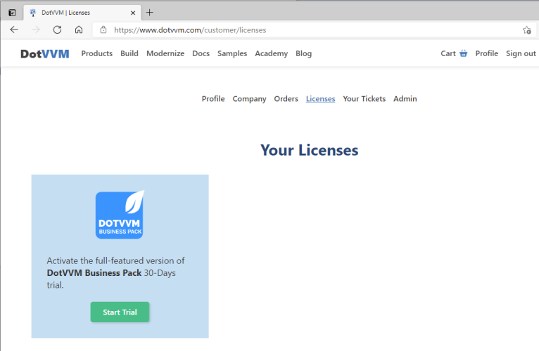
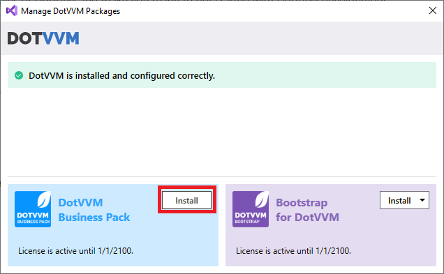

# Getting started with DotVVM Business Pack

[DotVVM Business Pack](https://www.dotvvm.com/products/dotvvm-business-pack) is a set of advanced components which can save a lot of time if you are building large line of business applications.

**Business Pack** ships with **~30 controls** you can see in the [Business Pack Gallery](https://www.dotvvm.com/gallery/business-pack/AutoComplete).

## Get 30-days trial

You can **try DotVVM Business Pack for 30 days for free**.

1. [Sign in on dotvvm.com](https://www.dotvvm.com/login)

2. In the **Licenses** section, request the trial version.



> If you need more time to test the features of DotVVM Business Pack, [contact us](https://www.dotvvm.com/support/contact-us) - we'll be happy to help.

## Install Business Pack in the project

1. Right-click on the project in the _Solution Explorer_ window in Visual Studio, and select the **Manage DotVVM Packages** option:


2. Click on the **Install** button in the _DotVVM Business Pack_ section.



> If you don't see any controls with the `<bp:` prefix in the IntelliSense after the packages are installed, try launching the application - the IntelliSense will refresh the project configuration.

## Manual installation

If you don't want to use the wizard, you can install Business Pack manually by taking the following steps:

1. Make sure you have configured [DotVVM Private NuGet Feed](~/pages/dotvvm-for-visual-studio/dotvvm-private-nuget-feed).

2. Install the `DotVVM.BusinessPack` package in the project.

2. Open the `DotvvmStartup.cs` file and add the following line in the `ConfigureService` method:

```CSHARP
public void ConfigureServices(IDotvvmServiceCollection options)
{
   options.AddBusinessPack();
   ...
}
``` 

This will register all Business Pack controls under the `<bp:*` tag prefix, and it also registers several Business Pack resources. 

## See also

* [Business Pack controls](~/controls/businesspack/Alert)
* [Themes](themes/overview)
* [Exporting data](exporting-data)
* [Release notes](release-notes)
