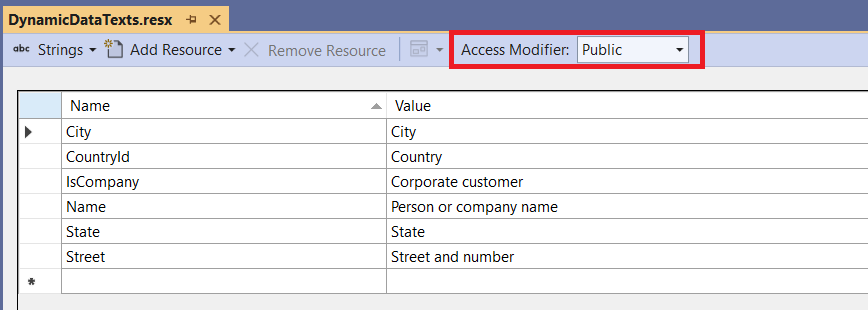

# Model metadata

The easiest way of providing metadata to properties in model classes is to use [Data annotation attributes](https://learn.microsoft.com/en-us/dotnet/api/system.componentmodel.dataannotations?view=net-7.0).

## Supported attributes

**Auto UI** supports several of these attributes and adds a few of its own attributes for features which are not covered by the standard ones.

| Attribute              | Namespace                               | Property                       | Fluent API methods                | Meaning                                  |
|------------------------|-----------------------------------------|--------------------------------|------------------------------------------|
| `Display`              | `System.ComponentModel.DataAnnotations` | `AutoGenerateField`            | `Hide`, `SetAutoGenerateField`    | Specifies whether the field should be generated or not. |
| `Display`              | `System.ComponentModel.DataAnnotations` | `Name`                         | `SetDisplayName`                  | Provides the label text for the field. If you set also the `ResourceType` property, the value will be looked up in the specified RESX file. |
| `Display`              | `System.ComponentModel.DataAnnotations` | `Prompt`                       |                                   | Provides the placeholder text for empty field. If you set also the `ResourceType` property, the value will be looked up in the specified RESX file. |
| `Display`              | `System.ComponentModel.DataAnnotations` | `Description`                  |                                   | Provides the description text for the field. If you set also the `ResourceType` property, the value will be looked up in the specified RESX file. |
| `Display`              | `System.ComponentModel.DataAnnotations` | `Order`                        | `SetOrder`                        | Provides the order of the field. If the property is not set, Auto UI will list the properties in the order they were declared in the class. |
| `Display`              | `System.ComponentModel.DataAnnotations` | `GroupName`                    | `SetGroupName`                    | Assigns the field in a group. The [Form](~/controls/builtin-autoui/Form) and [GridViewColumns](~/controls/builtin-autoui/GridViewColumns) controls can specify the `GroupName` property to include only properties from a specific group. |
| `DisplayFormat`        | `System.ComponentModel.DataAnnotations` | `DataFormatString`             | `SetFormatString`                 | Specifies the format string for the field value. |
| `DisplayFormat`        | `System.ComponentModel.DataAnnotations` | `NullDisplayText`              | `SetNullDisplayText`              | Specifies the text to be displayed when the field is null. |
| `DataType`             | `System.ComponentModel.DataAnnotations` | `DataType`                     | `SetDataType`                     | Specifies more precise classification of the field value which is reflected by the generated control (e. g. `Password`, `MultilineText`, `Url`...) |
| `Editable`             | `System.ComponentModel.DataAnnotations` | `AllowEdit`                    | `SetIsEditable`                   | Specifies whether the field can be edited or not. |
| `Enabled`              | `DotVVM.AutoUI.Annotations`             | `IsAuthenticated`              | `EnableIfAuthenticated`           | Specifies whether the field should be editable for authenticated or non-authenticated users, or for both (default behavior). |
| `Enabled`              | `DotVVM.AutoUI.Annotations`             | `Roles`                        | `EnableForRoles`                  | Specifies a name of the role or an expression that specifies for which roles the field should be editable. You can use ! (NOT), & (AND) and | (OR) operators. |
| `Enabled`              | `DotVVM.AutoUI.Annotations`             | `ViewNames`                    | `EnableForViews`                  | Specifies a name of the view or an expression that specifies for which views (set with the `ViewName` property on the [Form](~/controls/builtin-autoui/Form) and [GridViewColumns](~/controls/builtin-autoui/GridViewColumns) controls) the field should be editable. You can use ! (NOT), & (AND) and | (OR) operators. |
| `Selection`            | `DotVVM.AutoUI.Annotations`             | `SelectionType`                | `SetSelection`                    | Defines that the user will be selecting the value from a list of options, and defines the type of selection. A service implementing `ISelectionProvider<TSelectionType>` must be provided. See the [Selectors](./selectors) chapter for more info. |
| `Styles`               | `DotVVM.AutoUI.Annotations`             | `FormControlContainerCssClass` | `AddFormControlContainerCssClass` | Specifies the CSS class applied to the container of the form control (e.g. table cell which contains the TextBox control) for this field. |
| `Styles`               | `DotVVM.AutoUI.Annotations`             | `FormRowCssClass`              | `AddFormRowCssClass`              | Specifies the CSS class applied to the row in the form (e.g. table row which contains the label and the TextBox control) for this field. |
| `Styles`               | `DotVVM.AutoUI.Annotations`             | `FormControlCssClass`          | `AddFormControlCssClass`          | Specifies the CSS class applied to the control in the form. |
| `Styles`               | `DotVVM.AutoUI.Annotations`             | `GridCellCssClass`             | `AddGridCellCssClass`             | Specifies the CSS class applied to the GridView table cell for this field. |
| `Styles`               | `DotVVM.AutoUI.Annotations`             | `GridHeaderCellCssClass`       | `AddGridHeaderCellCssClass`       | Specifies the CSS class applied to the GridView table header cell for this field. |
| `Visible`              | `DotVVM.AutoUI.Annotations`             | `IsAuthenticated`              | `ShowIfAuthenticated`             | Specifies whether the field should be visible for authenticated or non-authenticated users, or for both (default behavior). |
| `Visible`              | `DotVVM.AutoUI.Annotations`             | `Roles`                        | `ShowForRoles`                    | Specifies a name of the role or an expression that specifies for which roles the field should be visible. You can use ! (NOT), & (AND) and | (OR) operators. |
| `Visible`              | `DotVVM.AutoUI.Annotations`             | `ViewNames`                    | `ShowForViews`                    | Specifies a name of the view or an expression that specifies for which views (set with the `ViewName` property on the [Form](~/controls/builtin-autoui/Form) and [GridViewColumns](~/controls/builtin-autoui/GridViewColumns) controls) the field should be visible. You can use ! (NOT), & (AND) and | (OR) operators. |
| `UIHint`               | `System.ComponentModel.DataAnnotations` | `UIHint`                       | `SetUIHint`                       | Specifies a identifier or a custom editor control which will be used for the property. This attribute can be specified multiple times to provide multiple UI hints. |

## Convention-based approach

Often, you may want to set the metadata based on naming or other conventions instead of polluting your code with several attributes on each property. 

**Auto UI** offers a fluent API which can easily set the convention to all properties satisfying a specified condition. 

This configuration is done in `DotvvmStartup.cs` when registering the **Auto UI**:

```CSHARP
options.AddAutoUI(config => {
    config.PropertyMetadataRules
        .For(typeof(decimal), rule => rule.SetFormatString("n2"))
        .For("Id", rule => rule.Hide())
        .For(prop => prop.Name.EndsWith("ImageUrl"), rule => rule.SetUIHint("ImageUpload"));
});
```

* The first rule says that all properties of `decimal` will use the `"n2"` format string.
* The second rule says that all properties with name `Id` will be hidden (`[Display(AutoGenerateField = false)]`).
* The third rule says that all properties with name ending with `ImageUrl` (for example `CustomerImageUrl`, `ProfileImageUrl` and so on) will get `[UIHint("ImageUpload")]` which will instruct the control to use a custom component for uploading the image (see the [Extensibility](./extensibility) chapter for more info).

There are methods in `config.PropertyMetadataRules` which help to set each property of each supported attribute from the table above.

## Resource file for field labels

The most common scenario is to set field labels by using the `[Display(Name = "xxx")]` attribute. If you want to localize the field label, you also need to specify the `ResourceType` property. 

Adding the `Display` attribute to every property in every model class can be annoying, that's why **Auto UI** offers a way to provide a RESX file with localizations for all fields. If no `Display` attribute is specified, the field name will be looked up in the RESX file. 



For a property called `CustomerName` in a class called `CustomerDetailModel`, Auto UI will first look for a key `CustomerDetailModel_CustomerName`. If it doesn't find it, it will look just for `CustomerName`. If even the second key is not found, Auto UI will try to make human-friendly name using the library [Humanizer](https://github.com/Humanizr/Humanizer).

Please make sure you have set the __Access Modifier__ in the default language RESX file to **Public**. Naturally, you can add additional resource files for each culture - for example `ResourceFileName.de-DE.resx` and so on.

To use the resource file, you need to specify it in `DotvvmStartup.cs` when registering Auto UI:

```CSHARP
options.AddAutoUI(config => {
    config.PropertyDisplayNamesResourceFile = typeof(YourResourceFile);
});
```

## Resource file for validation error messages

The same applies for error messages produced by validation attributes. For example, if you want to change the default error message for all `Required` attributes in your application, you can create another resource file with the validation error messages. They can use the `{0}` placeholder in which the field label will be substituted.

The key is always the attribute name without the `Attribute` suffix (e. g. `Display`, ...). 

```
Resource Key            Value
-------------------------------------------------------------------------------------
Required                {0} is required!    
EmailAddress            {0} is not a valid e-mail address!
...
```

Again, you can add additional resource files for each culture - for example `ResourceFileName.de-DE.resx` and so on.

```CSHARP
options.AddAutoUI(config => {
    config.ErrorMessagesResourceFile = typeof(YourResourceFile);
});
```

## Implementing your own metadata provider

Auto UI determines the metadata using its own implementation of `IPropertyDisplayMetadataProvider`. You can implement your own version (and possibly inherit from `DataAnnotationsPropertyDisplayMetadataProvider`) and register it in the service collection.

Please note that if you are using the resource files for providing field labels or error messages, you'll also need to wrap your implementation into the `ResourcePropertyDisplayMetadataProvider` before registering it in the service collection.

## See also

* [Auto UI Overview](./overview)
* [Selectors](./selectors)
* [Extensibility](./extensibility)
* [Validation overview](../validation/overview)