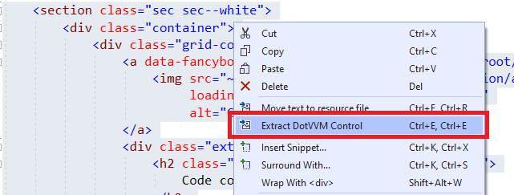

# Markup controls

It is very easy to create a markup control. First, you need to create a file with the `.dotcontrol` extension.

## Create a markup control

Simple markup controls don't need any C# code. In Visual Studio, right click on a project or folder in the *Solution Explorer* window, and select *Add > New Item*.


In the next window, keep the defaults and proceed.


## Extract markup control from page

Sometimes, you want to use the markup controls to keep your page markup shorter and cleaner. 

You can select a part of DotHTML markup, right-click on it, and select the _Extract markup-control_ option.



## Markup control structure

The `.dotcontrol` file can look like this:

```DOTHTML
@viewModel DotvvmDemo.Model.IAddress, DotvvmDemo

<table>
    <tr>
        <td>Street: </td>
        <td><dot:TextBox Text="{value: Street}" /></td>
    </tr>
    ...
    <tr>
        <td>Country: </td>
        <td>
        <dot:ComboBox DataSource="{value: Countries}" 
                      SelectedValue="{value: CountryId}" 
                      ItemTextBinding="{value: Name}" 
                      ItemValueBinding="{value: Id}" />
        </td>
    </tr>
</table>
```

### Binding context type

The markup control files must specify the `@viewModel` directive which tells DotVVM in which [binding context](~/pages/concepts/data-binding/binding-context) the control will be used. It can be an interface or a base class, but the control needs to know on which type the data-bindings are evaluated. 

You can see that the control above requires a binding context of type `IAddress`. It can be used on any place where the `DataContext` implements this interface.

> Remember that neither markup controls nor master pages create an instance of the viewmodel. Only pages have their own viewmodel instance. In master pages and markup controls, the `@viewModel` directive specifies the "contract" for the viewmodel - a base class of the viewmodel, or interface that the viewmodel must implement.  

If your markup control doesn't contain any data-bindings and doesn't depend on a specific viewmodel, use `@viewModel System.Object, mscorlib`. It means that the control can be used in any binding context.

### Control wrapper tag

Markup controls are wrapped inside a `div` tag by default. You can specify the tag you want to use by adding `@wrapperTag` directive. 

If you don't want to use any wrapper tag you can add the `@noWrapperTag` directive.

```DOTHTML
@viewModel DotvvmDemo.Model.IAddress, DotvvmDemo
@wrapperTag table

<tr>
    <td>Street: </td>
    <td><dot:TextBox Text="{value: Street}" /></td>
</tr>
...
<tr>
    <td>Country: </td>
    <td>
        <dot:ComboBox DataSource="{value: _control.Countries}" 
                      SelectedValue="{value: CountryId}" 
                      ItemTextBinding="{value: Name}" 
                      ItemValueBinding="{value: Id}" />
    </td>
</tr>
```

This will render the control inside the `table` tag.

## Register the markup control

In order to use the control, you need to [register it](markup-control-registration) in the `DotvvmStartup.cs` file. You can choose your own prefix and name for the control, e. g. `cc:AddressEditor`.

Then, the control can be used in the page like this:

```DOTHTML
<cc:AddressEditor DataContext="{value: ShippingAddress}" />
<cc:AddressEditor DataContext="{value: BillingAddress}" />
```

See the [Markup control registration](markup-control-registration) chapter for more info.

## Add custom properties to the control

The markup controls can declare custom properties, e. g. for passing additional information aside of the `DataContext`.

```DOTHTML
<cc:AddressEditor DataContext="{value: ShippingAddress}" Countries="{value: Countries}" />
```

Inside the control, you can then access these properties using the `_control` binding property:

```DOTHTML
<dot:ComboBox DataSource="{value: _control.Countries}" />
```

See the [Markup controls with code-behind](markup-controls-with-code) chapter for more info.

## See also

* [Markup control registration](markup-control-registration)
* [Markup controls with code](markup-controls-with-code)
* [Code-only controls](code-only-controls)
* [Adding interactivity using Knockout binding handlers](interactivity)