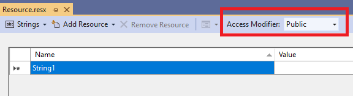
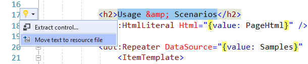

# RESX files

The easiest way to provide localized messages in DotVVM applications are the .NET resource files. 

## Resource binding

You can use the [resource binding](~/pages/concepts/data-binding/resource-binding) to reference localized entries from REST files. The default syntax is `{resource: FullNamespace.ResourceClass.ResourceKey}`. This will find the appropriate RESX file and use the value with the specified key.

For example, if you have a project named `MyWebApp` and you have a `Resources\Web\Strings.resx` file in the project, the resource class will 
be `MyWebApp.Resources.Web.Strings` (provided you haven't change the default namespace in the project properties). 

To retrieve the resource, you need to use the following expression:

```DOTHTML
<dot:Button Text="{resource: MyWebApp.Resources.Web.Strings.SomeResourceKey}" />
```

In order to simplify the expressions, you can import the namespace using the `@import` directive:

```DOTHTML
@import MyWebApp.Resources.Web
...
<dot:Button Text="{resource: Strings.SomeResourceKey}" />
```

## Create a RESX file

There should always be a language-neutral resource file with entries in the default language. The other languages should have the language-specific RESX files located in the same folder:

```
Resources/Web/Strings.resx          # language-neutral resource with default language
Resources/Web/Strings.cs-CZ.resx    # cs-CZ localization
Resources/Web/Strings.en-US.resx    # en-US localization
```

In order to access the RESX file entries, they must be generated as public members. Make sure that you have set the __Access Modifier__ field to **Public** in the **language-neutral RESX file**.



The public member generation should be enabled only on the language-neutral resource file. The language-specific files don't need it since they don't generate a C# class.

## Extract texts to RESX files

The commercial edition of [DotVVM for Visual Studio](https://www.dotvvm.com/products/visual-studio-extensions) includes a simple way to extract texts from pages to RESX files. This feature can save a lot of time when localizing larger applications.



## See also

* [Multi-language applications](multi-language-applications)
* [Formatting dates and numbers](formatting-dates-and-numbers)
* [Resource binding](~/pages/concepts/data-binding/resource-binding)