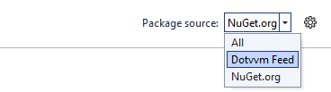

# Using DotVVM private NuGet feed

The [Bootstrap for DotVVM](https://www.dotvvm.com/products/bootstrap-for-dotvvm) and [DotVVM Business Pack](https://www.dotvvm.com/products/dotvvm-business-pack) controls are not available on the official NuGet feed, but they are shipped via **DotVVM Private NuGet Feed**.

This feed requires authentication and serves only the packages which you have purchased.

> The licenses for DotVVM component packages include 12 months of updates and fixes. If you purchase DotVVM Business Pack or Bootstrap for DotVVM, you will see all releases of the particular package immediately. Additionally, you will see all versions that we release within the next 12 months since the day of purchase.

There are two ways how you can configure the **DotVVM Private Feed** - using the DotVVM for Visual Studio extensions, or adding it manually using the command line.

## Method 1: Sign in to add the feed automatically

1. Install the [DotVVM for Visual Studio](https://www.dotvvm.com/get-dotvvm) extension. 

2. Navigate to the **Extensions > DotVVM > About** menu item and enter your credentials which you use at [DotVVM.com](https://www.dotvvm.com/login).

3. After you sign in, the extension will offer you to _install the DotVVM Private Nuget Feed automatically_. 

## Method 2: Add the feed manually using command line

1. Make sure you have installed [.NET SDK](https://dotnet.microsoft.com/en-us/download)

2. Open command line in any directory, and run this script (don't forget to fill your own credentials):

```
dotnet nuget add source "https://www.dotvvm.com/nuget/v3/index.json" --name "Dotvvm Feed" --username "YOUR EMAIL ADDRESS" --password "YOUR PASSWORD"
```

## Verify that you can see the packages

Right-click on the solution in Visual Studio and choose **Manage NuGet Packages for Solution**. You should be able to see the feed in the _Package source_ drop-down menu.



## Troubleshooting

1. If the **DotVVM for Visual Studio** fails to install the NuGet feed, make sure that you have the latest version of **NuGet Package Manager** extension
installed. You can update it in the **Tools > Extensions and Updates** menu in Visual Studio.

2. If you don't see any packages in the Dotvvm Private NuGet Feed, make sure you have [activated your license](https://www.dotvvm.com/customer/profile). After you purchase the licenses, you need to assign them to a specific user account.

3. Some packages in the feed are still not in final version. If you want to use pre-release versions, make sure you have checked the **Include Prerelease** box.

## See also

* [DotVVM for Visual Studio overview](overview)
* [Troubleshooting](troubleshooting)
* [Release notes](release-notes)