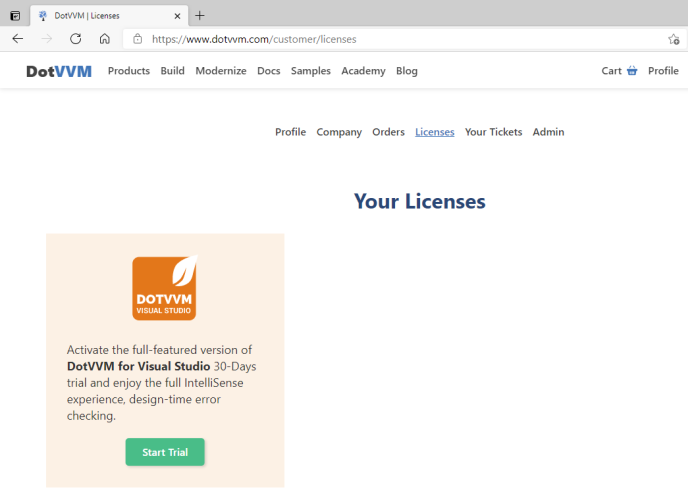

# DotVVM for Visual Studio overview

[DotVVM for Visual Studio](https://www.dotvvm.com/products/visual-studio-extensions) is an extension for **Visual Studio 2022 and 2019** which adds support for DotVVM projects.

The extension adds DotVVM project templates, syntax highlighting and IntelliSense in DotHTML files, and more. See the [complete list of features](https://www.dotvvm.com/products/visual-studio-extensions).

## Free edition vs subscription

The **free** version of the extension supports basic features, and can be used for both commercial and non-commercial projects.

If you want to build large projects in DotVVM, check out the [subscription](https://www.dotvvm.com/products/visual-studio-extensions). It has more features that can save a lot of time.

### Try subscription for 30-days

You can **try the subscription of DotVVM for Visual Studio for 30 days for free**.

1. [Sign in on dotvvm.com](https://www.dotvvm.com/login)

2. In the **Licenses** section, request the trial version.

3. Click on the **Extensions > DotVVM > About** item in the menu bar, and sign in with the account you created on the DotVVM website.

> If you need more time to test the features of DotVVM for Visual Studio, [contact us](https://www.dotvvm.com/support/contact-us) - we'll be happy to help.

## Install the extension

**The extension supports the latest releases of Visual Studio 2022 and 2019.** If you don't see the extension in the _Extension Manager_ window, make sure you have installed the **latest updates of VS**.

[Get DotVVM for Visual Studio](https://www.dotvvm.com/get-dotvvm)

## Pre-release & older versions

You can download older or pre-release versions on the [Release notes](release-notes) page.

## See also

* [DotVVM Private NuGet Feed](dotvvm-private-nuget-feed)
* [Troubleshooting](troubleshooting)
* [Release notes](release-notes)
