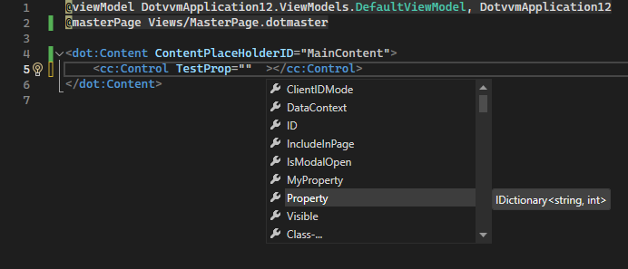
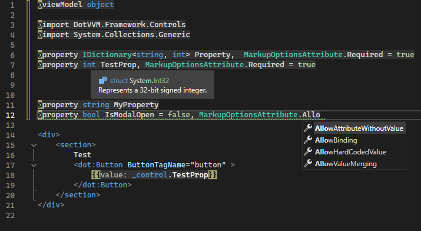

# Release notes

## v4.0.596.0
* Support for new Visual Studio versions

### Compatibility
* Version for Visual Studio 2019 (16.11.57)
* Version for Visual Studio 2022 (17.14.35 June 2026)
* Version for Visual Studio 2026 (18.7.1 June 2026 Feature Update)
* Version for Visual Studio 2026 Insiders (11912.234)

### Assets
Version for Visual Studio 2019: [download link](https://dotvvmstorage.blob.core.windows.net/public/v4.0.596.0/DotVVM.Integration.VisualStudio.VS2019.vsix)  
Version for Visual Studio 2022: [download link](https://dotvvmstorage.blob.core.windows.net/public/v4.0.596.0/DotVVM.Integration.VisualStudio.VS2022.vsix)  
Version for Visual Studio 2026: [download link](https://dotvvmstorage.blob.core.windows.net/public/v4.0.596.0/DotVVM.Integration.VisualStudio.VS2026.vsix)  
Version for Visual Studio 2026 Insiders: [download link](https://dotvvmstorage.blob.core.windows.net/public/v4.0.596.0/DotVVM.Integration.VisualStudio.VS2026-Insider.vsix)

## v4.0.595.0
* Support for new Visual Studio versions

### Compatibility
* Version for Visual Studio 2019 (16.11.56)
* Version for Visual Studio 2022 (17.14.32)
* Version for Visual Studio 2026 (18.6.0 May 2026 Feature Update)
* Version for Visual Studio 2026 Insiders (11811.120)

### Assets
Version for Visual Studio 2019: [download link](https://dotvvmstorage.blob.core.windows.net/public/v4.0.595.0/DotVVM.Integration.VisualStudio.VS2019.vsix)  
Version for Visual Studio 2022: [download link](https://dotvvmstorage.blob.core.windows.net/public/v4.0.595.0/DotVVM.Integration.VisualStudio.VS2022.vsix)  
Version for Visual Studio 2026: [download link](https://dotvvmstorage.blob.core.windows.net/public/v4.0.595.0/DotVVM.Integration.VisualStudio.VS2026.vsix)  
Version for Visual Studio 2026 Insiders: [download link](https://dotvvmstorage.blob.core.windows.net/public/v4.0.595.0/DotVVM.Integration.VisualStudio.VS2026-Insider.vsix)

## v4.0.594.0
* Greatly improved IntelliSense of Composite controls
* Support for new Visual Studio versions

### Compatibility
* Version for Visual Studio 2019 (16.11.55)
* Version for Visual Studio 2022 (17.14.30)
* Version for Visual Studio 2026 (18.5.0 April 2026 Feature Update)
* Version for Visual Studio 2026 Insiders (11709.129)

### Assets
Version for Visual Studio 2019: [download link](https://dotvvmstorage.blob.core.windows.net/public/v4.0.594.0/DotVVM.Integration.VisualStudio.VS2019.vsix)  
Version for Visual Studio 2022: [download link](https://dotvvmstorage.blob.core.windows.net/public/v4.0.594.0/DotVVM.Integration.VisualStudio.VS2022.vsix)  
Version for Visual Studio 2026: [download link](https://dotvvmstorage.blob.core.windows.net/public/v4.0.594.0/DotVVM.Integration.VisualStudio.VS2026.vsix)  
Version for Visual Studio 2026 Insiders: [download link](https://dotvvmstorage.blob.core.windows.net/public/v4.0.594.0/DotVVM.Integration.VisualStudio.VS2026-Insider.vsix)

## v4.0.593.0
* Support for new Visual Studio versions

### Compatibility
* Version for Visual Studio 2019 (16.11.54)
* Version for Visual Studio 2022 (17.14.29)
* Version for Visual Studio 2026 (18.4.1 March 2026 Feature Update)
* Version for Visual Studio 2026 Insiders (11612.153)

### Assets
Version for Visual Studio 2019: [download link](https://dotvvmstorage.blob.core.windows.net/public/v4.0.593.0/DotVVM.Integration.VisualStudio.VS2019.vsix)  
Version for Visual Studio 2022: [download link](https://dotvvmstorage.blob.core.windows.net/public/v4.0.593.0/DotVVM.Integration.VisualStudio.VS2022.vsix)  
Version for Visual Studio 2026: [download link](https://dotvvmstorage.blob.core.windows.net/public/v4.0.593.0/DotVVM.Integration.VisualStudio.VS2026.vsix)  
Version for Visual Studio 2026 Insiders: [download link](https://dotvvmstorage.blob.core.windows.net/public/v4.0.593.0/DotVVM.Integration.VisualStudio.VS2026-Insider.vsix)

## v4.0.592.0
* DotVVM updated to 5.0.0-preview07
* Support for new Visual Studio versions

### Compatibility
* Version for Visual Studio 2019 (16.11.53)
* Version for Visual Studio 2022 (17.14.27)
* Version for Visual Studio 2026 (18.3.1 February 2026 Feature Update)
* Version for Visual Studio 2026 Insiders (11513.90)

### Assets
Version for Visual Studio 2019: [download link](https://dotvvmstorage.blob.core.windows.net/public/v4.0.592.0/DotVVM.Integration.VisualStudio.VS2019.vsix)  
Version for Visual Studio 2022: [download link](https://dotvvmstorage.blob.core.windows.net/public/v4.0.592.0/DotVVM.Integration.VisualStudio.VS2022.vsix)  
Version for Visual Studio 2026: [download link](https://dotvvmstorage.blob.core.windows.net/public/v4.0.592.0/DotVVM.Integration.VisualStudio.VS2026.vsix)  
Version for Visual Studio 2026 Insiders: [download link](https://dotvvmstorage.blob.core.windows.net/public/v4.0.592.0/DotVVM.Integration.VisualStudio.VS2026-Insider.vsix)

## v4.0.591.0
* Support for new Visual Studio versions

### Compatibility
* Version for Visual Studio 2019 (16.11.53)
* Version for Visual Studio 2022 (17.14.24)
* Version for Visual Studio 2026 (18.2.0 January 2026 Feature Update)
* Version for Visual Studio 2026 Insiders (11408.92)

### Assets
Version for Visual Studio 2019: [download link](https://dotvvmstorage.blob.core.windows.net/public/v4.0.591.0/DotVVM.Integration.VisualStudio.VS2019.vsix)  
Version for Visual Studio 2022: [download link](https://dotvvmstorage.blob.core.windows.net/public/v4.0.591.0/DotVVM.Integration.VisualStudio.VS2022.vsix)  
Version for Visual Studio 2026: [download link](https://dotvvmstorage.blob.core.windows.net/public/v4.0.591.0/DotVVM.Integration.VisualStudio.VS2026.vsix)  
Version for Visual Studio 2026 Insiders: [download link](https://dotvvmstorage.blob.core.windows.net/public/v4.0.591.0/DotVVM.Integration.VisualStudio.VS2026-Insider.vsix)

## v4.0.590.0
* Support for new Visual Studio versions

### Compatibility
* Version for Visual Studio 2019 (16.11.53)
* Version for Visual Studio 2022 (17.14.23)
* Version for Visual Studio 2026 (18.1.1 December 2025 Feature Update)
* Version for Visual Studio 2026 Insiders (11312.210)

### Assets
Version for Visual Studio 2019: [download link](https://dotvvmstorage.blob.core.windows.net/public/v4.0.590.0/DotVVM.Integration.VisualStudio.VS2019.vsix)  
Version for Visual Studio 2022: [download link](https://dotvvmstorage.blob.core.windows.net/public/v4.0.590.0/DotVVM.Integration.VisualStudio.VS2022.vsix)  
Version for Visual Studio 2026: [download link](https://dotvvmstorage.blob.core.windows.net/public/v4.0.590.0/DotVVM.Integration.VisualStudio.VS2026.vsix)  
Version for Visual Studio 2026 Insiders: [download link](https://dotvvmstorage.blob.core.windows.net/public/v4.0.590.0/DotVVM.Integration.VisualStudio.VS2026-Insider.vsix)

## v4.0.589.0
* Support for new Visual Studio versions

### Compatibility
* Version for Visual Studio 2019 (16.11.53)
* Version for Visual Studio 2022 (17.14.21 November 2025)
* Version for Visual Studio 2026 (18.0.2 November 2025 Feature Update)
* Version for Visual Studio 2026 Insiders (11222.16)

### Assets
Version for Visual Studio 2019: [download link](https://dotvvmstorage.blob.core.windows.net/public/v4.0.589.0/DotVVM.Integration.VisualStudio.VS2019.vsix)  
Version for Visual Studio 2022: [download link](https://dotvvmstorage.blob.core.windows.net/public/v4.0.589.0/DotVVM.Integration.VisualStudio.VS2022.vsix)  
Version for Visual Studio 2026: [download link](https://dotvvmstorage.blob.core.windows.net/public/v4.0.589.0/DotVVM.Integration.VisualStudio.VS2026.vsix)  
Version for Visual Studio 2026 Insiders: [download link](https://dotvvmstorage.blob.core.windows.net/public/v4.0.589.0/DotVVM.Integration.VisualStudio.VS2026-Insider.vsix)

## v4.0.588.0
* Support for **Visual Studio 2026 RTM** and **Visual Studio 2026 Insiders**
* Removed support for Visual Studio 2022 Preview

### Compatibility
* Version for Visual Studio 2019 (16.11.53)
* Version for Visual Studio 2022 (17.14.20)
* Version for Visual Studio 2026 (18.0.0 November 2025 Feature Update)
* Version for Visual Studio 2026 Insiders (18.0.0 Insiders 11206.111)

### Assets
Version for Visual Studio 2019: [download link](https://dotvvmstorage.blob.core.windows.net/public/v4.0.588.0/DotVVM.Integration.VisualStudio.VS2019.vsix)  
Version for Visual Studio 2022: [download link](https://dotvvmstorage.blob.core.windows.net/public/v4.0.588.0/DotVVM.Integration.VisualStudio.VS2022.vsix)  
Version for Visual Studio 2026: [download link](https://dotvvmstorage.blob.core.windows.net/public/v4.0.588.0/DotVVM.Integration.VisualStudio.VS2026.vsix)  
Version for Visual Studio 2026 Insiders: [download link](https://dotvvmstorage.blob.core.windows.net/public/v4.0.588.0/DotVVM.Integration.VisualStudio.VS2026-Insider.vsix)

## v4.0.587.0
* Support for new Visual Studio versions **including Visual Studio 2026 Insiders**

### Compatibility
* Version for Visual Studio 2019 (16.11.51)
* Version for Visual Studio 2022 (17.14.16)
* Version for Visual Studio 2022 Preview (17.14.16 Preview 1.0)
* Version for Visual Studio 2026 Insiders (18.0.0 Insiders 11109.219)

### Assets
Version for Visual Studio 2019: [download link](https://dotvvmstorage.blob.core.windows.net/public/v4.0.587.0/DotVVM.Integration.VisualStudio.VS2019.vsix)  
Version for Visual Studio 2022: [download link](https://dotvvmstorage.blob.core.windows.net/public/v4.0.587.0/DotVVM.Integration.VisualStudio.VS2022.vsix)  
Version for Visual Studio 2022 Preview: [download link](https://dotvvmstorage.blob.core.windows.net/public/v4.0.587.0/DotVVM.Integration.VisualStudio.VS2022-Preview.vsix)  
Version for Visual Studio 2026 Insiders: [download link](https://dotvvmstorage.blob.core.windows.net/public/v4.0.587.0/DotVVM.Integration.VisualStudio.VS2026.vsix)

## v4.0.586.0
* Support for new Visual Studio versions **including Visual Studio 2026 Insiders**

### Compatibility
* Version for Visual Studio 2019 (16.11.51)
* Version for Visual Studio 2022 (17.14.16)
* Version for Visual Studio 2022 Preview (17.14.16 Preview 1.0)
* Version for Visual Studio 2026 Insiders (18.0.0 Insiders 11018.127)

### Assets
Version for Visual Studio 2019: [download link](https://dotvvmstorage.blob.core.windows.net/public/v4.0.586.0/DotVVM.Integration.VisualStudio.VS2019.vsix)  
Version for Visual Studio 2022: [download link](https://dotvvmstorage.blob.core.windows.net/public/v4.0.586.0/DotVVM.Integration.VisualStudio.VS2022.vsix)  
Version for Visual Studio 2022 Preview: [download link](https://dotvvmstorage.blob.core.windows.net/public/v4.0.586.0/DotVVM.Integration.VisualStudio.VS2022-Preview.vsix)  
Version for Visual Studio 2026 Insiders: [download link](https://dotvvmstorage.blob.core.windows.net/public/v4.0.586.0/DotVVM.Integration.VisualStudio.VS2026.vsix)

## v4.0.585.0
* Support for new Visual Studio versions

### Compatibility
* Version for Visual Studio 2019 (16.11.49)
* Version for Visual Studio 2022 (17.14.10)
* Version for Visual Studio 2022 Preview (17.14.0 Preview 1.0)

### Assets
Version for Visual Studio 2019: [download link](https://dotvvmstorage.blob.core.windows.net/public/v4.0.585.0/DotVVM.Integration.VisualStudio.VS2019.vsix)  
Version for Visual Studio 2022: [download link](https://dotvvmstorage.blob.core.windows.net/public/v4.0.585.0/DotVVM.Integration.VisualStudio.VS2022.vsix)  
Version for Visual Studio 2022 Preview: [download link](https://dotvvmstorage.blob.core.windows.net/public/v4.0.585.0/DotVVM.Integration.VisualStudio.VS2022-Preview.vsix)

## v4.0.584.0
* Support for new Visual Studio versions

### Compatibility
* Version for Visual Studio 2019 (16.11.47)
* Version for Visual Studio 2022 (17.14.0)
* Version for Visual Studio 2022 Preview (17.15.0 Preview 1.0)

### Assets
Version for Visual Studio 2019: [download link](https://dotvvmstorage.blob.core.windows.net/public/v4.0.584.0/DotVVM.Integration.VisualStudio.VS2019.vsix)  
Version for Visual Studio 2022: [download link](https://dotvvmstorage.blob.core.windows.net/public/v4.0.584.0/DotVVM.Integration.VisualStudio.VS2022.vsix)  
Version for Visual Studio 2022 Preview: [download link](https://dotvvmstorage.blob.core.windows.net/public/v4.0.584.0/DotVVM.Integration.VisualStudio.VS2022-Preview.vsix)

## v4.0.582.0
* Support for new Visual Studio versions
* Project template updated to .NET 9 and DotVVM 5.0 Preview 02

### Compatibility
* Version for Visual Studio 2019 (16.11.46)
* Version for Visual Studio 2022 (17.13.6)
* Version for Visual Studio 2022 Preview (17.14.0 Preview 4.0)

### Assets
Version for Visual Studio 2019: [download link](https://dotvvmstorage.blob.core.windows.net/public/v4.0.582.0/DotVVM.Integration.VisualStudio.VS2019.vsix)  
Version for Visual Studio 2022: [download link](https://dotvvmstorage.blob.core.windows.net/public/v4.0.582.0/DotVVM.Integration.VisualStudio.VS2022.vsix)  
Version for Visual Studio 2022 Preview: [download link](https://dotvvmstorage.blob.core.windows.net/public/v4.0.582.0/DotVVM.Integration.VisualStudio.VS2022-Preview.vsix)

## v4.0.581.0
* Support for new Visual Studio versions

### Compatibility
* Version for Visual Studio 2019 (16.11.44)
* Version for Visual Studio 2022 (17.13.1)
* Version for Visual Studio 2022 Preview (17.14.0 Preview 1.1)

### Assets
Version for Visual Studio 2019: [download link](https://dotvvmstorage.blob.core.windows.net/public/v4.0.581.0/DotVVM.Integration.VisualStudio.VS2019.vsix)  
Version for Visual Studio 2022: [download link](https://dotvvmstorage.blob.core.windows.net/public/v4.0.581.0/DotVVM.Integration.VisualStudio.VS2022.vsix)  
Version for Visual Studio 2022 Preview: [download link](https://dotvvmstorage.blob.core.windows.net/public/v4.0.581.0/DotVVM.Integration.VisualStudio.VS2022-Preview.vsix)

## v4.0.580.0
* Support for new Visual Studio versions
* Fixed bug with loading DotvvmPackage

### Compatibility
* Version for Visual Studio 2019 (16.11.43)
* Version for Visual Studio 2022 (17.12.4)
* Version for Visual Studio 2022 Preview (17.13.0 Preview 3.0)

### Assets
Version for Visual Studio 2019: [download link](https://dotvvmstorage.blob.core.windows.net/public/v4.0.580.0/DotVVM.Integration.VisualStudio.VS2019.vsix)  
Version for Visual Studio 2022: [download link](https://dotvvmstorage.blob.core.windows.net/public/v4.0.580.0/DotVVM.Integration.VisualStudio.VS2022.vsix)  
Version for Visual Studio 2022 Preview: [download link](https://dotvvmstorage.blob.core.windows.net/public/v4.0.580.0/DotVVM.Integration.VisualStudio.VS2022-Preview.vsix)

## v4.0.579.0
* Support for new Visual Studio versions
* Fixed bug in VS 2019 in adding DotVVM pages in the project

### Compatibility
* Version for Visual Studio 2019 (16.11.43)
* Version for Visual Studio 2022 (17.12.4)
* Version for Visual Studio 2022 Preview (17.13.0 Preview 2.1)

### Assets
Version for Visual Studio 2019: [download link](https://dotvvmstorage.blob.core.windows.net/public/v4.0.579.0/DotVVM.Integration.VisualStudio.VS2019.vsix)  
Version for Visual Studio 2022: [download link](https://dotvvmstorage.blob.core.windows.net/public/v4.0.579.0/DotVVM.Integration.VisualStudio.VS2022.vsix)  
Version for Visual Studio 2022 Preview: [download link](https://dotvvmstorage.blob.core.windows.net/public/v4.0.579.0/DotVVM.Integration.VisualStudio.VS2022-Preview.vsix)

## v4.0.578.0
* Support for new Visual Studio versions

### Compatibility
* Version for Visual Studio 2019 (16.11.42)
* Version for Visual Studio 2022 (17.12.3)
* Version for Visual Studio 2022 Preview (17.13.0 Preview 1.0)

### Assets
Version for Visual Studio 2019: [download link](https://dotvvmstorage.blob.core.windows.net/public/v4.0.578.0/DotVVM.Integration.VisualStudio.VS2019.vsix)  
Version for Visual Studio 2022: [download link](https://dotvvmstorage.blob.core.windows.net/public/v4.0.578.0/DotVVM.Integration.VisualStudio.VS2022.vsix)  
Version for Visual Studio 2022 Preview: [download link](https://dotvvmstorage.blob.core.windows.net/public/v4.0.578.0/DotVVM.Integration.VisualStudio.VS2022-Preview.vsix)

## v4.0.577.0
* Fixed a bug which caused extension not being able to handle complex generic types in control properties
* Support for new Visual Studio versions

### Compatibility
* Version for Visual Studio 2019 (16.11.42)
* Version for Visual Studio 2022 (17.12.0)
* Version for Visual Studio 2022 Preview (17.13.0 Preview 1.0)

### Assets
Version for Visual Studio 2019: [download link](https://dotvvmstorage.blob.core.windows.net/public/v4.0.577.0/DotVVM.Integration.VisualStudio.VS2019.vsix)  
Version for Visual Studio 2022: [download link](https://dotvvmstorage.blob.core.windows.net/public/v4.0.577.0/DotVVM.Integration.VisualStudio.VS2022.vsix)  
Version for Visual Studio 2022 Preview: [download link](https://dotvvmstorage.blob.core.windows.net/public/v4.0.577.0/DotVVM.Integration.VisualStudio.VS2022-Preview.vsix)

## v4.0.576.0
* Support for new Visual Studio versions

### Compatibility
* Version for Visual Studio 2019 (16.11.41)
* Version for Visual Studio 2022 (17.11.5)
* Version for Visual Studio 2022 Preview (17.12.0 Preview 3.0)

### Assets
Version for Visual Studio 2019: [download link](https://dotvvmstorage.blob.core.windows.net/public/v4.0.576.0/DotVVM.Integration.VisualStudio.VS2019.vsix)  
Version for Visual Studio 2022: [download link](https://dotvvmstorage.blob.core.windows.net/public/v4.0.576.0/DotVVM.Integration.VisualStudio.VS2022.vsix)  
Version for Visual Studio 2022 Preview: [download link](https://dotvvmstorage.blob.core.windows.net/public/v4.0.576.0/DotVVM.Integration.VisualStudio.VS2022-Preview.vsix)

## v4.0.575.0
* Full support of aliases and imports
* @viewmodel @baseType @service work with usings and type aliases
* Markup defined properties (@property directive) now have full intellisense
* Markup defined properties (@property directive) now have error tagging
* Markup defined properties are suggested in as members of _control alias
* Markup defined properties are suggested on control usages

### Compatibility
* Version for Visual Studio 2019 (16.11.39)
* Version for Visual Studio 2022 (17.11.0)
* Version for Visual Studio 2022 Preview (17.12.0 Preview 1.0)

### Assets
Version for Visual Studio 2019: [download link](https://dotvvmstorage.blob.core.windows.net/public/v4.0.575.0/DotVVM.Integration.VisualStudio.VS2019.vsix)  
Version for Visual Studio 2022: [download link](https://dotvvmstorage.blob.core.windows.net/public/v4.0.575.0/DotVVM.Integration.VisualStudio.VS2022.vsix)  
Version for Visual Studio 2022 Preview: [download link](https://dotvvmstorage.blob.core.windows.net/public/v4.0.575.0/DotVVM.Integration.VisualStudio.VS2022-Preview.vsix)

## v4.0.574.0
* Support for new Visual Studio versions

### Compatibility
* Version for Visual Studio 2019 (16.11.39)
* Version for Visual Studio 2022 (17.11.0)
* Version for Visual Studio 2022 Preview (17.12.0 Preview 1.0)

### Assets
Version for Visual Studio 2019: [download link](https://dotvvmstorage.blob.core.windows.net/public/v4.0.574.0/DotVVM.Integration.VisualStudio.VS2019.vsix)  
Version for Visual Studio 2022: [download link](https://dotvvmstorage.blob.core.windows.net/public/v4.0.574.0/DotVVM.Integration.VisualStudio.VS2022.vsix)  
Version for Visual Studio 2022 Preview: [download link](https://dotvvmstorage.blob.core.windows.net/public/v4.0.574.0/DotVVM.Integration.VisualStudio.VS2022-Preview.vsix)

## v4.0.573.0
* Support for new Visual Studio versions

### Compatibility
* Version for Visual Studio 2019 (16.11.38)
* Version for Visual Studio 2022 (17.10.5)
* Version for Visual Studio 2022 Preview (17.11.0 Preview 5.0)

### Assets
Version for Visual Studio 2019: [download link](https://dotvvmstorage.blob.core.windows.net/public/v4.0.573.0/DotVVM.Integration.VisualStudio.VS2019.vsix)  
Version for Visual Studio 2022: [download link](https://dotvvmstorage.blob.core.windows.net/public/v4.0.573.0/DotVVM.Integration.VisualStudio.VS2022.vsix)  
Version for Visual Studio 2022 Preview: [download link](https://dotvvmstorage.blob.core.windows.net/public/v4.0.573.0/DotVVM.Integration.VisualStudio.VS2022-Preview.vsix)

## v4.0.572.0
* Support for new Visual Studio versions

### Compatibility
* Version for Visual Studio 2019 (16.11.37)
* Version for Visual Studio 2022 (17.10.3)
* Version for Visual Studio 2022 Preview (17.11.0 Preview 3.0)

### Assets
Version for Visual Studio 2019: [download link](https://dotvvmstorage.blob.core.windows.net/public/v4.0.572.0/DotVVM.Integration.VisualStudio.VS2019.vsix)  
Version for Visual Studio 2022: [download link](https://dotvvmstorage.blob.core.windows.net/public/v4.0.572.0/DotVVM.Integration.VisualStudio.VS2022.vsix)  
Version for Visual Studio 2022 Preview: [download link](https://dotvvmstorage.blob.core.windows.net/public/v4.0.572.0/DotVVM.Integration.VisualStudio.VS2022-Preview.vsix)

## v4.0.571.0
* Support for new Visual Studio versions

### Compatibility
* Version for Visual Studio 2019 (16.11.37)
* Version for Visual Studio 2022 (17.10.2)
* Version for Visual Studio 2022 Preview (17.11.0 Preview 2.0)

### Assets
Version for Visual Studio 2019: [download link](https://dotvvmstorage.blob.core.windows.net/public/v4.0.571.0/DotVVM.Integration.VisualStudio.VS2019.vsix)  
Version for Visual Studio 2022: [download link](https://dotvvmstorage.blob.core.windows.net/public/v4.0.571.0/DotVVM.Integration.VisualStudio.VS2022.vsix)  
Version for Visual Studio 2022 Preview: [download link](https://dotvvmstorage.blob.core.windows.net/public/v4.0.571.0/DotVVM.Integration.VisualStudio.VS2022-Preview.vsix)

## v4.0.570.0
* Support for new Visual Studio versions

### Compatibility
* Version for Visual Studio 2019 (16.11.36)
* Version for Visual Studio 2022 (17.10.0)
* Version for Visual Studio 2022 Preview (17.11.0 Preview 1.0)

### Assets
Version for Visual Studio 2019: [download link](https://dotvvmstorage.blob.core.windows.net/public/v4.0.570.0/DotVVM.Integration.VisualStudio.VS2019.vsix)  
Version for Visual Studio 2022: [download link](https://dotvvmstorage.blob.core.windows.net/public/v4.0.570.0/DotVVM.Integration.VisualStudio.VS2022.vsix)  
Version for Visual Studio 2022 Preview: [download link](https://dotvvmstorage.blob.core.windows.net/public/v4.0.570.0/DotVVM.Integration.VisualStudio.VS2022-Preview.vsix)

## v4.0.569.0
* Support for new Visual Studio versions

### Compatibility
* Version for Visual Studio 2019 (16.11.35)
* Version for Visual Studio 2022 (17.9.6)
* Version for Visual Studio 2022 Preview (17.10.0 Preview 4.0)

### Assets
Version for Visual Studio 2019: [download link](https://dotvvmstorage.blob.core.windows.net/public/v4.0.569.0/DotVVM.Integration.VisualStudio.VS2019.vsix)  
Version for Visual Studio 2022: [download link](https://dotvvmstorage.blob.core.windows.net/public/v4.0.569.0/DotVVM.Integration.VisualStudio.VS2022.vsix)  
Version for Visual Studio 2022 Preview: [download link](https://dotvvmstorage.blob.core.windows.net/public/v4.0.569.0/DotVVM.Integration.VisualStudio.VS2022-Preview.vsix)

### Assets v4.3.569.0-preview02
Version for Visual Studio 2019: [download link](https://dotvvmstorage.blob.core.windows.net/public/v4.3.569.0-preview02/DotVVM.Integration.VisualStudio.VS2019.vsix)  
Version for Visual Studio 2022: [download link](https://dotvvmstorage.blob.core.windows.net/public/v4.3.569.0-preview02/DotVVM.Integration.VisualStudio.VS2022.vsix)  
Version for Visual Studio 2022 Preview: [download link](https://dotvvmstorage.blob.core.windows.net/public/v4.3.569.0-preview02/DotVVM.Integration.VisualStudio.VS2022-Preview.vsix)

## v4.3.568.0-preview01

* Markup defined properties (`@property` directive) now have full intellisense
* Markup defined properties (`@property` directive) now have error tagging
* Markup defined properties are suggested in as members of `_control` alias
* Markup defined properties are suggested on control usages

### Compatibility
* Version for Visual Studio 2019 (16.11.34)
* Version for Visual Studio 2022 (17.9.0)
* Version for Visual Studio 2022 Preview (17.10.0 Preview 1.0)

### Assets
Version for Visual Studio 2019: [download link](https://dotvvmstorage.blob.core.windows.net/public/v4.3.568.0-preview01/DotVVM.Integration.VisualStudio.VS2019.vsix)  
Version for Visual Studio 2022: [download link](https://dotvvmstorage.blob.core.windows.net/public/v4.3.568.0-preview01/DotVVM.Integration.VisualStudio.VS2022.vsix)  
Version for Visual Studio 2022 Preview: [download link](https://dotvvmstorage.blob.core.windows.net/public/v4.3.568.0-preview01/DotVVM.Integration.VisualStudio.VS2022-Preview.vsix)

## v4.0.568.0

* Dependencies fixed
* Project templates updated to .NET 8

### Compatibility
* Version for Visual Studio 2019 (16.11.34)
* Version for Visual Studio 2022 (17.9.4)
* Version for Visual Studio 2022 Preview (17.10.0 Preview 2.0)

### Assets
Version for Visual Studio 2019: [download link](https://dotvvmstorage.blob.core.windows.net/public/v4.0.568.0/DotVVM.Integration.VisualStudio.VS2019.vsix)  
Version for Visual Studio 2022: [download link](https://dotvvmstorage.blob.core.windows.net/public/v4.0.568.0/DotVVM.Integration.VisualStudio.VS2022.vsix)  
Version for Visual Studio 2022 Preview: [download link](https://dotvvmstorage.blob.core.windows.net/public/v4.0.568.0/DotVVM.Integration.VisualStudio.VS2022-Preview.vsix)

## v4.0.567.0

* Dependencies fixed

### Compatibility
* Version for Visual Studio 2019 (16.11.34)
* Version for Visual Studio 2022 (17.9.0)
* Version for Visual Studio 2022 Preview (17.10.0 Preview 1.0)

### Assets
Version for Visual Studio 2019: [download link](https://dotvvmstorage.blob.core.windows.net/public/v4.0.567.0/DotVVM.Integration.VisualStudio.VS2019.vsix)  
Version for Visual Studio 2022: [download link](https://dotvvmstorage.blob.core.windows.net/public/v4.0.567.0/DotVVM.Integration.VisualStudio.VS2022.vsix)  
Version for Visual Studio 2022 Preview: [download link](https://dotvvmstorage.blob.core.windows.net/public/v4.0.567.0/DotVVM.Integration.VisualStudio.VS2022-Preview.vsix)

## v4.0.566.0

* Project templates for DotVVM 4.2

### Compatibility
* Version for Visual Studio 2019 (16.11.32)
* Version for Visual Studio 2022 (17.8.0)
* Version for Visual Studio 2022 Preview (17.9.0 Preview 1.0)

### Assets
Version for Visual Studio 2019: [download link](https://dotvvmstorage.blob.core.windows.net/public/v4.0.566.0/DotVVM.Integration.VisualStudio.VS2019.vsix)  
Version for Visual Studio 2022: [download link](https://dotvvmstorage.blob.core.windows.net/public/v4.0.566.0/DotVVM.Integration.VisualStudio.VS2022.vsix)  
Version for Visual Studio 2022 Preview: [download link](https://dotvvmstorage.blob.core.windows.net/public/v4.0.566.0/DotVVM.Integration.VisualStudio.VS2022-Preview.vsix)

## v4.0.565.0

* Fixed adding DotVVM to web projects

### Compatibility
* Version for Visual Studio 2019 (16.11.29)
* Version for Visual Studio 2022 (17.7.3)
* Version for Visual Studio 2022 Preview (17.8.0 Preview 1.0)

### Assets
Version for Visual Studio 2019: [download link](https://dotvvmstorage.blob.core.windows.net/public/v4.0.565.0/DotVVM.Integration.VisualStudio.VS2019.vsix)  
Version for Visual Studio 2022: [download link](https://dotvvmstorage.blob.core.windows.net/public/v4.0.565.0/DotVVM.Integration.VisualStudio.VS2022.vsix)  
Version for Visual Studio 2022 Preview: [download link](https://dotvvmstorage.blob.core.windows.net/public/v4.0.565.0/DotVVM.Integration.VisualStudio.VS2022-Preview.vsix)

## v4.0.564.0

* Fixed bug that prevented old .NET Framework projects to load

### Compatibility
* Version for Visual Studio 2019 (16.11.29)
* Version for Visual Studio 2022 (17.7.1)
* Version for Visual Studio 2022 Preview (17.8.0 Preview 1.0)

### Assets
Version for Visual Studio 2019: [download link](https://dotvvmstorage.blob.core.windows.net/public/v4.0.564.0/DotVVM.Integration.VisualStudio.VS2019.vsix)  
Version for Visual Studio 2022: [download link](https://dotvvmstorage.blob.core.windows.net/public/v4.0.564.0/DotVVM.Integration.VisualStudio.VS2022.vsix)  
Version for Visual Studio 2022 Preview: [download link](https://dotvvmstorage.blob.core.windows.net/public/v4.0.564.0/DotVVM.Integration.VisualStudio.VS2022-Preview.vsix)

## v4.0.563.0

### Compatibility
* Version for Visual Studio 2019 (16.11.29)
* Version for Visual Studio 2022 (17.7.0)
* Version for Visual Studio 2022 Preview (17.8.0 Preview 1.0)

### Assets
Version for Visual Studio 2019: [download link](https://dotvvmstorage.blob.core.windows.net/public/v4.0.563.0/DotVVM.Integration.VisualStudio.VS2019.vsix)  
Version for Visual Studio 2022: [download link](https://dotvvmstorage.blob.core.windows.net/public/v4.0.563.0/DotVVM.Integration.VisualStudio.VS2022.vsix)  
Version for Visual Studio 2022 Preview: [download link](https://dotvvmstorage.blob.core.windows.net/public/v4.0.563.0/DotVVM.Integration.VisualStudio.VS2022-Preview.vsix)

## v4.0.562.0

### Compatibility
* Version for Visual Studio 2019 (16.11.27)
* Version for Visual Studio 2022 (17.6.5)
* Version for Visual Studio 2022 Preview (17.7.0 Preview 4.0)

### Assets
Version for Visual Studio 2019: [download link](https://dotvvmstorage.blob.core.windows.net/public/v4.0.562.0/DotVVM.Integration.VisualStudio.VS2019.vsix)  
Version for Visual Studio 2022: [download link](https://dotvvmstorage.blob.core.windows.net/public/v4.0.562.0/DotVVM.Integration.VisualStudio.VS2022.vsix)  
Version for Visual Studio 2022 Preview: [download link](https://dotvvmstorage.blob.core.windows.net/public/v4.0.562.0/DotVVM.Integration.VisualStudio.VS2022-Preview.vsix)

## v4.0.561.0

- Extract control now has more helpfull error messages
- Curly bracket auto-completion now works again when starting bindings
- Fixed extension not suggesting static readonly and const members
- Fixed behavior where dotvvm prevented attribute values from being suggested
- Fixed Format document and Format selection features
- Compatibility with new Visual Studio

### Compatibility
* Version for Visual Studio 2019 (16.11.27)
* Version for Visual Studio 2022 (17.6.4)
* Version for Visual Studio 2022 Preview (17.7.0 Preview 2.0)

### Assets
Version for Visual Studio 2019: [download link](https://dotvvmstorage.blob.core.windows.net/public/v4.0.561.0/DotVVM.Integration.VisualStudio.VS2019.vsix)  
Version for Visual Studio 2022: [download link](https://dotvvmstorage.blob.core.windows.net/public/v4.0.561.0/DotVVM.Integration.VisualStudio.VS2022.vsix)  
Version for Visual Studio 2022 Preview: [download link](https://dotvvmstorage.blob.core.windows.net/public/v4.0.561.0/DotVVM.Integration.VisualStudio.VS2022-Preview.vsix)

## v4.0.558.0
* Fixed various compatibility issues with VS 2022 and VS 2022-Preview

### Compatibility
* Version for Visual Studio 2019 (16.11.26)
* Version for Visual Studio 2022 (17.6.0)
* Version for Visual Studio 2022 Preview (17.7.0 Preview 1.0)

### Assets
Version for Visual Studio 2019: [download link](https://dotvvmstorage.blob.core.windows.net/public/DotVVM.Integration.VisualStudio.VS2019.RTM.4.0.558.0.vsix)  
Version for Visual Studio 2022: [download link](https://dotvvmstorage.blob.core.windows.net/public/DotVVM.Integration.VisualStudio.VS2022.RTM.4.0.558.0.vsix)  
Version for Visual Studio 2022 Preview: [download link](https://dotvvmstorage.blob.core.windows.net/public/DotVVM.Integration.VisualStudio.VS2022-Preview.4.0.558.0.vsix)

## v4.0.557.0
* Fixed various compatibility issues with VS 2022 and VS 2022-Preview

### Compatibility
* Version for Visual Studio 2019 (16.11.25)
* Version for Visual Studio 2022 (17.5.3)
* Version for Visual Studio 2022 Preview (17.6.0 Preview 2.0)

### Assets
Version for Visual Studio 2019: [download link](https://dotvvmstorage.blob.core.windows.net/public/DotVVM.Integration.VisualStudio.VS2019.RTM.4.0.557.0.vsix)  
Version for Visual Studio 2022: [download link](https://dotvvmstorage.blob.core.windows.net/public/DotVVM.Integration.VisualStudio.VS2022.RTM.4.0.557.0.vsix)  
Version for Visual Studio 2022 Preview: [download link](https://dotvvmstorage.blob.core.windows.net/public/DotVVM.Integration.VisualStudio.VS2022-Preview.4.0.557.0.vsix)

## v4.0.556.0
* Project templates updated to DotVVM 4.1, added support for .NET 7

### Compatibility
* Version for Visual Studio 2019 (16.11.21)
* Version for Visual Studio 2022 (17.5.0)
* Version for Visual Studio 2022 Preview (17.6.0 Preview 1.0)

### Assets
Version for Visual Studio 2019: [download link](https://dotvvmstorage.blob.core.windows.net/public/DotVVM.Integration.VisualStudio.VS2019.4.0.556.0.vsix)  
Version for Visual Studio 2022: [download link](https://dotvvmstorage.blob.core.windows.net/public/DotVVM.Integration.VisualStudio.VS2022.4.0.556.0.vsix)  
Version for Visual Studio 2022 Preview: [download link](https://dotvvmstorage.blob.core.windows.net/public/DotVVM.Integration.VisualStudio.VS2022-Preview.4.0.556.0.vsix)

## v4.0.554.0
* Placing `div` in a dot:Repeater no longer produces a warning
* IntelliSense for composite controls no longer suggest `Content` property

### Compatibility
* Version for Visual Studio 2019 (16.11.21)
* Version for Visual Studio 2022 (17.4.1)
* Version for Visual Studio 2022 Preview (17.5.0 Preview 1.0)

### Assets
Version for Visual Studio 2019: [download link](https://dotvvmstorage.blob.core.windows.net/public/DotVVM.Integration.VisualStudio.VS2019.RTM.4.0.554.0.vsix)  
Version for Visual Studio 2022: [download link](https://dotvvmstorage.blob.core.windows.net/public/DotVVM.Integration.VisualStudio.VS2022.RTM.4.0.554.0.vsix)  
Version for Visual Studio 2022 Preview: [download link](https://dotvvmstorage.blob.core.windows.net/public/DotVVM.Integration.VisualStudio.VS2022-Preview.4.0.554.0.vsix)

## v4.0.553.0

### Compatibility
* Version for Visual Studio 2019 (16.11.21)
* Version for Visual Studio 2022 (17.4.0)

### Assets
Version for Visual Studio 2019: [download link](https://dotvvmstorage.blob.core.windows.net/public/DotVVM.Integration.VisualStudio.VS2019.RTM.4.0.553.0.vsix)  
Version for Visual Studio 2022: [download link](https://dotvvmstorage.blob.core.windows.net/public/DotVVM.Integration.VisualStudio.VS2022.RTM.4.0.553.0.vsix)

## v4.0.552.0
* Project system improvements
* Fixed a bug with resolving syntax trees for certain projects

### Compatibility
* Version for Visual Studio 2019 (16.11.19)
* Version for Visual Studio 2022 (17.3.5)
* Version for Visual Studio 2022 Preview (17.4.0 Preview 2.1)

### Assets
Version for Visual Studio 2019: [download link](https://dotvvmstorage.blob.core.windows.net/public/DotVVM.Integration.VisualStudio.VS2019.RTM.4.0.552.0.vsix)  
Version for Visual Studio 2022: [download link](https://dotvvmstorage.blob.core.windows.net/public/DotVVM.Integration.VisualStudio.VS2022.RTM.4.0.552.0.vsix)  
Version for Visual Studio 2022 Preview: [download link](https://dotvvmstorage.blob.core.windows.net/public/DotVVM.Integration.VisualStudio.VS2022-Preview.4.0.552.0.vsix)

## v4.0.551.0
* Fixed issue with loading projects

### Compatibility
* Version for Visual Studio 2019 (16.11.19)
* Version for Visual Studio 2022 (17.3.5)
* Version for Visual Studio 2022 Preview (17.4.0 Preview 2.1)

### Assets
Version for Visual Studio 2019: [download link](https://dotvvmstorage.blob.core.windows.net/public/DotVVM.Integration.VisualStudio.VS2019.RTM.4.0.551.0.vsix)  
Version for Visual Studio 2022: [download link](https://dotvvmstorage.blob.core.windows.net/public/DotVVM.Integration.VisualStudio.VS2022.RTM.4.0.551.0.vsix)  
Version for Visual Studio 2022 Preview: [download link](https://dotvvmstorage.blob.core.windows.net/public/DotVVM.Integration.VisualStudio.VS2022-Preview.4.0.551.0.vsix)

## v4.0.550.0
* Fixed issue with extension using lower-cased paths in most situations	
	* All paths should now be correctly cased and use '/' as directory separators
* Fixed NRE when using shift-f7 and there are multiple candidates
* Fixed NRE when resolving configuration and project is not yet loaded
* Removed unsupported path suggestions from extract control dialog
* Default name for extracted control now begins with capital letter
	* This better reflects conventions used both by DotVVM and .NET in general

### Compatibility
* Version for Visual Studio 2019 (16.11.19)
* Version for Visual Studio 2022 (17.3.4)
* Version for Visual Studio 2022 Preview (17.4.0 Preview 2.1)

### Assets
Version for Visual Studio 2019: [download link](https://dotvvmstorage.blob.core.windows.net/public/DotVVM.Integration.VisualStudio.VS2019.RTM.4.0.550.0.vsix)  
Version for Visual Studio 2022: [download link](https://dotvvmstorage.blob.core.windows.net/public/DotVVM.Integration.VisualStudio.VS2022.RTM.4.0.550.0.vsix)  
Version for Visual Studio 2022 Preview: [download link](https://dotvvmstorage.blob.core.windows.net/public/DotVVM.Integration.VisualStudio.VS2022-Preview.4.0.550.0.vsix)

## v4.0.549.0
* Fixed VS breaking changes

### Compatibility
* Version for Visual Studio 2019 (16.11.18)
* Version for Visual Studio 2022 (17.3.0)
* Version for Visual Studio 2022 Preview (17.4.0 Preview 1.0)

### Assets
Version for Visual Studio 2019: [download link](https://dotvvmstorage.blob.core.windows.net/public/DotVVM.Integration.VisualStudio.VS2019.RTM.4.0.549.0.vsix)  
Version for Visual Studio 2022: [download link](https://dotvvmstorage.blob.core.windows.net/public/DotVVM.Integration.VisualStudio.VS2022.RTM.4.0.549.0.vsix)  
Version for Visual Studio 2022 Preview: [download link](https://dotvvmstorage.blob.core.windows.net/public/DotVVM.Integration.VisualStudio.VS2022-Preview.4.0.549.0.vsix)

## v4.0.548.0

### Compatibility
* Version for Visual Studio 2022 Preview (17.3.0 Preview 6.0)

### Assets
Version for Visual Studio 2022 Preview: [download link](https://dotvvmstorage.blob.core.windows.net/public/DotVVM.Integration.VisualStudio.VS2022-Preview.4.0.548.0.vsix)

## v4.0.547.0
* Extract text to RESX dialog now checks for restricted keywords (ToString, GetHashCode...)
* Extract text to RESX dialog now checks for duplicities and recommends fixes (create new record, merge records...)	
* Fixed VS breaking changes affecting autocompletion and intellisense

### Compatibility
* Version for Visual Studio 2019 (16.11.17)
* Version for Visual Studio 2022 (17.2.6)
* Version for Visual Studio 2022 Preview (17.3.0 Preview 5.0)

### Assets
Version for Visual Studio 2019: [download link](https://dotvvmstorage.blob.core.windows.net/public/DotVVM.Integration.VisualStudio.VS2019.RTM.4.0.547.0.vsix)  
Version for Visual Studio 2022: [download link](https://dotvvmstorage.blob.core.windows.net/public/DotVVM.Integration.VisualStudio.VS2022.RTM.4.0.547.0.vsix)  
Version for Visual Studio 2022 Preview: [download link](https://dotvvmstorage.blob.core.windows.net/public/DotVVM.Integration.VisualStudio.VS2022-Preview.4.0.547.0.vsix)

## v4.0.546.0
* Updated project templates to use newest DotVVM packages
* Extract text to RESX dialog now allows more complex resource keys
* Fixed extract text to RESX dialog sometimes silently crashing when parsing project references
* Fixed auto-reloading issue with rewritten RESX files
* Fixed package not found error when creating new OWIN projects

### Compatibility
* Version for Visual Studio 2019 (16.11.17)
* Version for Visual Studio 2022 (17.2.6)
* Version for Visual Studio 2022 Preview (17.3.0 Preview 3.0)

### Assets
Version for Visual Studio 2019: [download link](https://dotvvmstorage.blob.core.windows.net/public/DotVVM.Integration.VisualStudio.VS2019.RTM.4.0.546.0.vsix)  
Version for Visual Studio 2022: [download link](https://dotvvmstorage.blob.core.windows.net/public/DotVVM.Integration.VisualStudio.VS2022.RTM.4.0.546.0.vsix)  
Version for Visual Studio 2022 Preview: [download link](https://dotvvmstorage.blob.core.windows.net/public/DotVVM.Integration.VisualStudio.VS2022-Preview.4.0.546.0.vsix)

## v4.0.545.0
* Fixed dialogs sometimes not being able to read / write files

### Compatibility
* Version for Visual Studio 2019 (16.11.16)
* Version for Visual Studio 2022 (17.2.5)
* Version for Visual Studio 2022 Preview (17.3.0 Preview 2.0)

### Assets
Version for Visual Studio 2019: [download link](https://dotvvmstorage.blob.core.windows.net/public/DotVVM.Integration.VisualStudio.VS2019.RTM.4.0.545.0.vsix)  
Version for Visual Studio 2022: [download link](https://dotvvmstorage.blob.core.windows.net/public/DotVVM.Integration.VisualStudio.VS2022.RTM.4.0.545.0.vsix)  
Version for Visual Studio 2022 Preview: [download link](https://dotvvmstorage.blob.core.windows.net/public/DotVVM.Integration.VisualStudio.VS2022-Preview.4.0.545.0.vsix)

## v4.0.544.0
* Added support for composite controls	
* Fixed "Add User Control" dialog	
* Fixed "Extract DotVVM Control" dialog	
* Fixed Shift-F7 command	
* Partially fixed extract to RESX file (auto-reloading is still not working though...)	
* Removed usage of culture-sensitive string operations

### Compatibility
* Version for Visual Studio 2019 (16.11.16)
* Version for Visual Studio 2022 (17.2.4)
* Version for Visual Studio 2022 Preview (17.3.0 Preview 2.0)

### Assets
Version for Visual Studio 2019: [download link](https://dotvvmstorage.blob.core.windows.net/public/DotVVM.Integration.VisualStudio.VS2019.RTM.4.0.544.0.vsix)  
Version for Visual Studio 2022: [download link](https://dotvvmstorage.blob.core.windows.net/public/DotVVM.Integration.VisualStudio.VS2022.RTM.4.0.544.0.vsix)  
Version for Visual Studio 2022 Preview: [download link](https://dotvvmstorage.blob.core.windows.net/public/DotVVM.Integration.VisualStudio.VS2022-Preview.4.0.544.0.vsix)

## v4.0.543.0
* Added reliable way to query referenced DotVVM Framework version
* Improved stability by fixing exceptions being thrown on various actions
* Improved syntax highlighting for nested string interpolation
* Fixed auto-completion issues for directives
* Fixed binding end recognition

### Compatibility
* Version for Visual Studio 2019 (16.11.14)
* Version for Visual Studio 2022 (17.2.0)
* Version for Visual Studio 2022 Preview (17.3.0 Preview 1.0)

### Assets
Version for Visual Studio 2019: [download link](https://dotvvmstorage.blob.core.windows.net/public/DotVVM.Integration.VisualStudio.VS2019.RTM.4.0.543.0.vsix)  
Version for Visual Studio 2022: [download link](https://dotvvmstorage.blob.core.windows.net/public/DotVVM.Integration.VisualStudio.VS2022.RTM.4.0.543.0.vsix)  
Version for Visual Studio 2022 Preview: [download link](https://dotvvmstorage.blob.core.windows.net/public/DotVVM.Integration.VisualStudio.VS2022-Preview.4.0.543.0.vsix)

## v4.0.541.0
* Fixed "Manage DotVVM packages" button
* Fixed "Add DotVVM" button
* Fixed F12 shortcut to enter control definition
* Fixed breaking changes in some dialogs
* Improvements in the way we work with file system and access NuGet package references

### Compatibility
* Version for Visual Studio 2019 (16.11.13)
* Version for Visual Studio 2022 (17.1.5)
* Version for Visual Studio 2022 Preview (17.2.0 Preview 4.0)

### Assets
Version for Visual Studio 2019: [download link](https://dotvvmstorage.blob.core.windows.net/public/DotVVM.Integration.VisualStudio.VS2019.RTM.4.0.541.0.vsix)  
Version for Visual Studio 2022: [download link](https://dotvvmstorage.blob.core.windows.net/public/DotVVM.Integration.VisualStudio.VS2022.RTM.4.0.541.0.vsix)  
Version for Visual Studio 2022 Preview: [download link](https://dotvvmstorage.blob.core.windows.net/public/DotVVM.Integration.VisualStudio.VS2022-Preview.4.0.541.0.vsix)

## v4.0.539.0
* Added initial support for string interpolation (syntax highlighting)
* Updated project templates to DotVVM 4.0
* Updated YouTube channel link in templates

### Compatibility
* Version for Visual Studio 2019 (16.11.11)
* Version for Visual Studio 2022 (17.1.2)
* Version for Visual Studio 2022 Preview (17.2.0 Preview 2.1)

### Assets
Version for Visual Studio 2019: [download link](https://dotvvmstorage.blob.core.windows.net/public/DotVVM.Integration.VisualStudio.VS2019.RTM.4.0.539.0.vsix)  
Version for Visual Studio 2022: [download link](https://dotvvmstorage.blob.core.windows.net/public/DotVVM.Integration.VisualStudio.VS2022.RTM.4.0.539.0.vsix)  
Version for Visual Studio 2022 Preview: [download link](https://dotvvmstorage.blob.core.windows.net/public/DotVVM.Integration.VisualStudio.VS2022-Preview.4.0.539.0.vsix)

## v4.0.538.0

### Compatibility
* Version for Visual Studio 2022 Preview (17.2.0 Preview 1.0+)

### Assets
Version for Visual Studio 2022 Preview: [download link](https://dotvvmstorage.blob.core.windows.net/public/DotVVM.Integration.VisualStudio.VS2022-Preview.4.0.538.0.vsix)

## v4.0.537.0

### Compatibility
* Version for Visual Studio 2022 (17.1.0)
* Version for Visual Studio 2022 Preview (17.1.0 Preview 6.0+)

### Assets
Version for Visual Studio 2022: [download link](https://dotvvmstorage.blob.core.windows.net/public/DotVVM.Integration.VisualStudio.VS2022.RTM.4.0.537.0.vsix)  
Version for Visual Studio 2022 Preview: [download link](https://dotvvmstorage.blob.core.windows.net/public/DotVVM.Integration.VisualStudio.VS2022-Preview.4.0.537.0.vsix)

## v4.0.536.0

### Compatibility
* Version for Visual Studio 2022 Preview (17.1.0 Preview 4.0+)

### Assets
Version for Visual Studio 2022 Preview: [download link](https://dotvvmstorage.blob.core.windows.net/public/DotVVM.Integration.VisualStudio.VS2022-Preview.4.0.536.0.vsix)

## v4.0.535.0

### Compatibility
* Version for Visual Studio 2022 Preview (17.1.0 Preview 3.0+)

### Assets
Version for Visual Studio 2022 Preview: [download link](https://dotvvmstorage.blob.core.windows.net/public/DotVVM.Integration.VisualStudio.VS2022-Preview.4.0.535.0.vsix)

## v4.0.534.0
* Added support for lambda functions (syntax highlighting and Intellisense)
* Added autocompletion capabilities for more operators
* Fixed F7 shortcut
* Fixed analysis of `Required` properties in controls
* Improved categorization of identifiers
* Stability fixes: resolved some exceptions during startup

### Compatibility
* Version for Visual Studio 2019 (16.11.8+)
* Version for Visual Studio 2022 (17.0.4+)
* Version for Visual Studio 2022 Preview (17.1.0 Preview 2.0+)

### Assets
Version for Visual Studio 2019: [download link](https://dotvvmstorage.blob.core.windows.net/public/DotVVM.Integration.VisualStudio.VS2019.RTM.4.0.534.0.vsix)  
Version for Visual Studio 2022: [download link](https://dotvvmstorage.blob.core.windows.net/public/DotVVM.Integration.VisualStudio.VS2022.RTM.4.0.534.0.vsix)  
Version for Visual Studio 2022 Preview: [download link](https://dotvvmstorage.blob.core.windows.net/public/DotVVM.Integration.VisualStudio.VS2022-Preview.4.0.534.0.vsix)

## v4.0.532.0

### Assets
Version for Visual Studio 2019: [download link](https://dotvvmstorage.blob.core.windows.net/public/DotVVM.Integration.VisualStudio.VS2019-RTM.4.0.532.0.vsix)  
Version for Visual Studio 2022: [download link](https://dotvvmstorage.blob.core.windows.net/public/DotVVM.Integration.VisualStudio.VS2022-RTM.4.0.532.0.vsix)  
Version for Visual Studio 2022 Preview (17.1.0 Preview 1.1+): [download link](https://dotvvmstorage.blob.core.windows.net/public/DotVVM.Integration.VisualStudio.VS2022-Preview.4.0.532.0.vsix) 

## v2.5.254.0
***Compatible with VS 2019 v16.10+***
* Fixed Visual Studio API changes
* Several fixes of DotHTML editor. 

#### Known issues
* IntelliSense does not work correctly when creating a new binding. Once it is created then it works correctly.
* Some DotHTML files cannot be parsed. This issue is dependent on the installed version of DotVVM Framework. 

### Assets
Version for Visual Studio 2019: [download link](https://storage.dotvvm.com/public/DotVVM.Integration.VisualStudio.VS2019.RTM.2.5.254.0.vsix)  
Version for Visual Studio 2019 Preview (16.11 Preview 1.0+): [download link](https://storage.dotvvm.com/public/DotVVM.Integration.VisualStudio.VS2019-Preview.2.5.254.0.vsix) 

## v2.5.251.0
***Compatible with VS 2019 v16.9.3+***
* Fixed Visual Studio API changes

### Assets
Version for Visual Studio 2019: [download link](https://storage.dotvvm.com/public/DotVVM.Integration.VisualStudio.VS2019.RTM.2.5.251.0.vsix)  
Version for Visual Studio 2019 Preview (16.10.0 Preview 1.0+): [download link](https://storage.dotvvm.com/public/DotVVM.Integration.VisualStudio.VS2019-Preview.2.5.251.0.vsix) 

## v2.5.249.0
* Fixed Visual Studio API changes

### Assets
Version for Visual Studio 2019 Preview (16.9.0 Preview 5.0+): [download link](https://storage.dotvvm.com/public/DotVVM.Integration.VisualStudio.VS2019-Preview.2.5.249.0.vsix) 

## v2.5.245.0
***Compatible with VS 2019 v16.8.4+***
* Fixed Visual Studio API changes

### Assets
Version for Visual Studio 2019: [download link](https://storage.dotvvm.com/public/DotVVM.Integration.VisualStudio.VS2019.RTM.2.5.245.0.vsix)  
Version for Visual Studio 2019 Preview (16.9.0 Preview 2.0+): [download link](https://storage.dotvvm.com/public/DotVVM.Integration.VisualStudio.VS2019-Preview.2.5.245.0.vsix) 

## v2.5.239.0
***Compatible with VS 2019 v16.8.0 -&gt; v16.8.3***
* Fixed About Dialog - incorrect indication of license information
### Assets
Version for Visual Studio 2019: [download link](https://storage.dotvvm.com/public/DotVVM.Integration.VisualStudio.VS2019.RTM.2.5.239.0.vsix)  

## v2.5.236.0
***Compatible with VS 2019 v16.8.0 -&gt; v16.8.3***
* Minor performance enhancements
* .NET 5.0 templates support
* Redesign About DotVVM Dialog
* New feature - Navigate to markup control code-behind on Shift + F7     

## v2.5.231.0
***Compatible with VS 2019 v16.8.+***
* Fixed Visual Studio API compatibility issues
* Minor performance enhancements
* Updated templates to DotVVM 2.5

## v2.4.213.0
***Compatible with VS 2019 v16.7.+***
* Fixed changed Visual Studio API compatibility issues
* Fixed performance issues during writing in bindings
* Fixed Quick Info in bindings

## v2.4.205.0
***Compatible with VS 2019 v16.6.4+***
* Fixed configuration loading issue
* Fixed Master Page template issue

## v2.4.203.0
***Compatible with VS 2019 v16.6.4+***
* Improved DotVVM configuration loading
* DotHTML Editor - Quick Info fixed
* DotHTML Editor - Suggested Actions improvements 
* Improved performance of loading dothtml files 
* Stability improvements - Updated Visual Studio APIs to latest versions 
* Updated DotVVM Templates - new design of welcome page
* Improved dialogs for actions "Extract Hard-Coded Texts in RESX Files" and "Extract User Control Feature"

## v2.4.180.0
***Compatible with VS 2019 v16.5.4+***
* IntelliSense for Bindings fixes
* DotHTML Editor - fixed formatting issues
* Stability improvements - Updated Visual Studio APIs to latest versions
* Improved design time resolving of controls 
* Updated DotVVM Templates

## v2.4.172.0
***Compatible with VS 2019 v16.4.2+***
* Fixed IntelliSense for DotVVM 2.4.0
* Stability improvements 

## v2.0.117.0
***Compatible with VS 2017 v15.8.0+***
* Fixed DotVVM configuration deserialization problems

## v2.0.115.0
* Fixed Proxy server authentication via NTLM  
* BusinessPack sample project updated to version 2.0.0-preview11-final
* Azure AD authentication sample
* Stability improvements

## v2.0.112.0
* Added new section "DotVVM for Visual Studio" in Tool -> Options.
* Added new section "Proxy settings" to "DotVVM for Visual Studio" in Options window.
* Updated all templates to DotVVM 2.0
* Some fixes in IntelliSense - REST bindings support

## v2.0.109.0
* Visual Studio failed to load when a project was opened from sln directly.
* Added support for *_index*, *_collection*, *_page*, *_api*

## v2.0.105.0
* Deadlock during controls resolving fixed.
* Fixed IntelliSense in element Columns of GridView.
