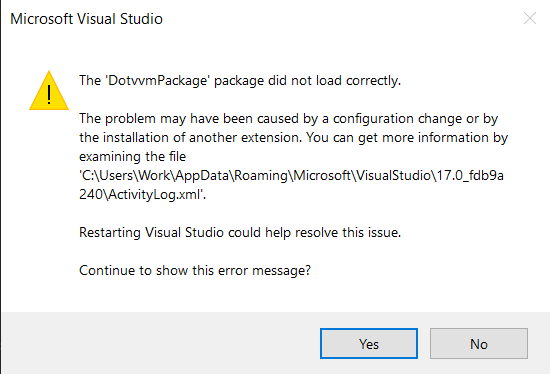

# Troubleshooting DotVVM for Visual Studio

The purpose of this page is to describe common issues with DotVVM for Visual Studio along with their troubleshooting guide.

## Visual Studio failed to load the extension



Most issues our users encounter while using Visual Studio Extension for DotVVM are caused by incompatibility. Each released extension is guaranteed to be compatible with the latest update of their Visual Studio installation. Therefore, running an older DotVVM for Visual Studio Extension against the most recent Visual Studio update is not compatible and vice-versa.

### 1. Check your Visual Studio version

In Visual Studio, go to **About / About Microsoft Visual Studio**. You should find there the exact version of you installed Visual Studio. Alternatively, you could open up the Visual Studio Installer application, which lists all your installed Visual Studios alongside with their versions.

### 2. Check DotVVM for Visual Studio release notes

Some time ago, we decided to include compatibility information for every released DotVVM for Visual Studio Extension. This can be found on our [release notes](release-notes). There is a list of all extension releases with download links, changelogs and most importantly, compability info. You want to ensure that you have installed a compatible extension version for your Visual Studio. For example:

* Assume you have Visual Studio 2022 (17.2.6). In our release notes, you can find this version listed under compatibility section for extension build v4.0.547.0. This means that this version is compatible with your Visual Studio and should work correctly.
* Assume you updated your Visual Studio 2022 to version 17.3.0. Immediately after update, you probably saw a warning that states that the extension could not been loaded. Furthermore, if we look into releases notes once more, we would find this Visual Studio version listed under compatibility section for extension build v4.0.549.0. Therefore, alongside with Visual Studio you should also update DotVVM for Visual Studio

### 3. Automatic updates setup (optional)

In order to minimize or even completely avoid potential problems with compatibility, set up automatic updates for Visual Studio Extension for DotVVM. You can turn this on in **Extensions / Manage Extensions / Installed / DotVVM for Visual Studio xxxx** dialog. There should be a checkbox -- "Automatically update this extension". Then whenever there is an update, you can should also update you Visual Studio. This approach ensures that you are always running latest and compatible software both from DotVVM Team and from Microsoft.

### 4. Delete the component model cache

If your extension still does not load, it sometimes helps to delete the MEF component cache. In order to delete the cache, shut down Visual Studio and go to `%localappdata%\Microsoft\VisualStudio\17.0` and delete the whole `ComponentModelCache` folder. You don't have to worry too much about it, Visual Studio will recreate it during the next startup.

## Extension loads but does not work correctly

The second category of issues describe situations where the extension has been successfully loaded, however, user is experiencing issues with some of its basic features (e.g. IntelliSense is not working).

### 1. Ensure you are using compatible extension

One of the root causes of random bugs and basic functionality not working correctly is incompability. Therefore, before continuing, ensure that you are running compatible DotVVM Extension and Visual Studio.

### 2. Check that you are signed in

Some features from the **commercial** edition work only if you are signed in. 
In Visual Studio, choose the **DotVVM / About** and check whether your license is active and whether you are signed in.

## "DotVVM.Compiler.exe not found in the project"

If you open a DotVVM project in Visual Studio, sometimes you can see the yellow bar with the following error message:

```DOTHTML
'DotVVM.Compiler.exe' not found in the project YourProjectName!
``` 

Also, IntelliSense in DOTHTML files is broken, the directives are being underlined etc. 

Visual Studio uses the DotVVM Compiler to read the settings in the `DotvvmStartup` file, or to precompile the DOTVVM views.

### How to resolve the issue

The most common reason for this behavior is that Visual Studio cannot find the `DotVVM` binaries, because they are not
present in the `packages` folder. 

You can resolve this simply by **building the solution**. In the default settings, the Visual Studio runs the **NuGet package 
restore** before the build, and this operation downloads missing NuGet packages. The `DotVVM` package contains the DotVVM Compiler
binary.

If the package restore doesn't help, you can look at the **Output** window in the Visual Studio. If you display the output from DotVVM,
you'll see the exception the compiler has returned, and the stack trace. Maybe you can figure out what's wrong from the exception -
it can be caused by something you have used in the `DotvvmStartup.cs`. Please, keep in mind, that the DotVVM for Visual Studio has 
to actually execute the `DotvvmStartup.cs` to be able to retrieve the configuration data.    

## Other issues

If the issue still occurs, [contact us](https://www.dotvvm.com/support) and provide us with description of the problem and screenshots.

## See also

* [DotVVM Private NuGet Feed](dotvvm-private-nuget-feed)
* [Release notes](release-notes)