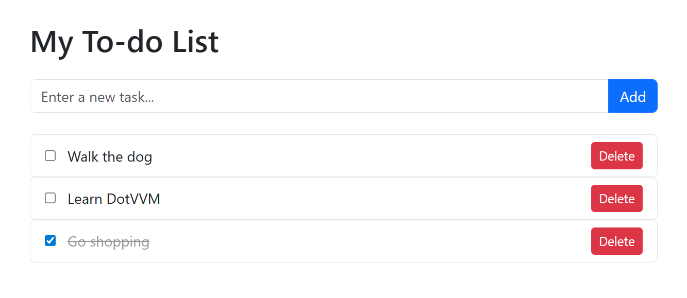

# Build a To-do list app

Let's create a simple to-do list application in DotVVM. The application will allow users to add new tasks, mark them as complete, and delete tasks. This is a great first project to learn the fundamentals of DotVVM including data-binding, event handling, and viewmodels.



## Prerequisites

* You have [created a new DotVVM project](create-new-project) and understand the basic project structure.
* You are familiar with the [first page](first-page) concepts including views and viewmodels.
* You have a basic understanding of C# and HTML.

## Step 1: Create the viewmodel

First, we'll create a viewmodel to handle the to-do list logic. Add a page called `TodoList.dothtml` into the `Views` folder. The `ViewModels/TodoListViewModel.cs` file should be created automatically.

Update it to look like this (replace `YourProjectName` with your project name): 

```CSHARP
using System;
using System.Collections.Generic;
using System.Linq;

namespace YourProjectName.ViewModels
{
    public class ToDoListViewModel : MasterPageViewModel
    {
        public List<TodoItem> Todos { get; set; } = new();

        public string NewTodoTitle { get; set; }

        public void AddTodo()
        {
            if (string.IsNullOrWhiteSpace(NewTodoTitle))
            {
                return;
            }

            Todos.Add(new TodoItem
            {
                Id = Guid.NewGuid(),
                Title = NewTodoTitle,
                IsCompleted = false,
                CreatedAt = DateTime.Now
            });

            NewTodoTitle = string.Empty;
        }

        public void DeleteTodo(Guid id)
        {
            var todo = Todos.FirstOrDefault(t => t.Id == id);
            if (todo != null)
            {
                Todos.Remove(todo);
            }
        }
    }

    public class TodoItem
    {
        public Guid Id { get; set; }
        public string Title { get; set; }
        public bool IsCompleted { get; set; }
        public DateTime CreatedAt { get; set; }
    }
}
```

## Step 2: Create the view

By default, the `ToDoList.dothtml` page is using a [master page](~/pages/concepts/layout/master-pages) to have a shared header and footer for all pages. 

To keep things simple, we'll not use it for now. Remove everything in the page and use the following code (just replace `YourProjectName` with your project name):

```DOTHTML
@viewModel YourProjectName.ViewModels.ToDoListViewModel, YourProjectName

<!DOCTYPE html>
<html lang="en">
<head>
    <meta charset="utf-8" />
    <title>To-do List</title>
    <meta name="viewport" content="width=device-width, initial-scale=1.0" />
    <link href="https://cdn.jsdelivr.net/npm/bootstrap@5.3.8/dist/css/bootstrap.min.css" rel="stylesheet" crossorigin="anonymous">
    <style>
    .todo-item {
        cursor: pointer;

        .completed {
            text-decoration: line-through;
            color: #999;
        }
    }
    </style>
</head>
<body>
    <div class="container">
        <h1 class="my-4">My To-do List</h1>

        <!-- Add New Todo Section -->
        <form class="input-group my-4">
            <dot:TextBox Text="{value: NewTodoTitle}"
                         Placeholder="Enter a new task..."
                         class="form-control" />
            <dot:Button Text="Add"
                        Click="{command: AddTodo()}"
                        IsSubmitButton="true"
                        class="btn btn-primary" />
        </form>

        <!-- Todos List -->
        <dot:Repeater DataSource="{value: Todos}">
            <EmptyDataTemplate>
                <div class="fst-italic text-secondary">
                    No tasks yet. Add one to get started!
                </div>
            </EmptyDataTemplate>
            <div class="border rounded px-3 py-2 d-flex flex-row align-items-center">
                <dot:CheckBox class="todo-item flex-grow-1"
                              Checked="{value: IsCompleted}">
                    <span class="ms-2"
                          Class-completed="{value: IsCompleted}">
                        {{value: Title}}
                    </span>
                </dot:CheckBox>

                <dot:Button Text="Delete"
                            Click="{command: _root.DeleteTodo(Id)}"
                            class="btn btn-sm btn-danger" />
            </div>
        </dot:Repeater>
    </div>
</body>
</html>
```

## Step 3: Register the route

In the `DotvvmStartup.cs` file, add a route to register the new page. Find the `ConfigureRoutes` method and add the following line:

```csharp
config.RouteTable.Add("TodoList", "todos", "Views/TodoList.dothtml", new { });
```

## Step 4: Run the application

Press **F5** to run the application and navigate to `/todos` in your browser. You should now see the to-do list application with the ability to add, complete, and delete tasks.

## Understanding the code

### The viewmodel

* **Todos**: A `List<TodoItem>` that holds all the to-do items. In contrast to WPF and other MVVM frameworks in .NET, you don't need to use `ObservableCollection` - DotVVM will handle triggering the change notifications in the browser itself.

* **NewTodoTitle**: A property that binds to the text input field where users enter new tasks.

* **AddTodo()**: This method is called when the user clicks the "Add" button. It creates a new `TodoItem` and adds it to the collection.

* **DeleteTodo(id)**: This method removes a task from the collection.

### The view

* **dot:TextBox**: A DotVVM control for text input, bound to the `NewTodoTitle` viewmodel property.

* **dot:Button**: A DotVVM button control. The `Click` event is bound to viewmodel commands.

* **dot:Repeater**: A control that renders a list of items. In this case, it displays all the to-do items from the `Todos` collection.

* **Checked binding**: The checkbox is bound to the `IsCompleted` property, allowing two-way binding.

* **class-`completed`** binding: The element will have the `completed` CSS class when the `IsCompleted` property is `true`; otherwise, the class will be removed.

* **_root**: A special binding target that refers to the root viewmodel from within an item template. We use it when we want to call methods in the parent binding context (such as the `DeleteTodo` method).

## Styling and customization

The example uses Bootstrap for styling. You can customize the appearance by:

* Modifying the CSS classes to use different Bootstrap components.
* Adding more properties to the `TodoItem` class (such as priority, due date, or tags).
* Implementing filtering to show only completed or incomplete tasks.
* Adding persistence by saving to-do items to a database.

## See also

* [Data-binding](~/pages/concepts/data-binding/overview)
* [Viewmodels](~/pages/concepts/viewmodels/overview)
* [Commands](~/pages/concepts/respond-to-user-actions/overview)