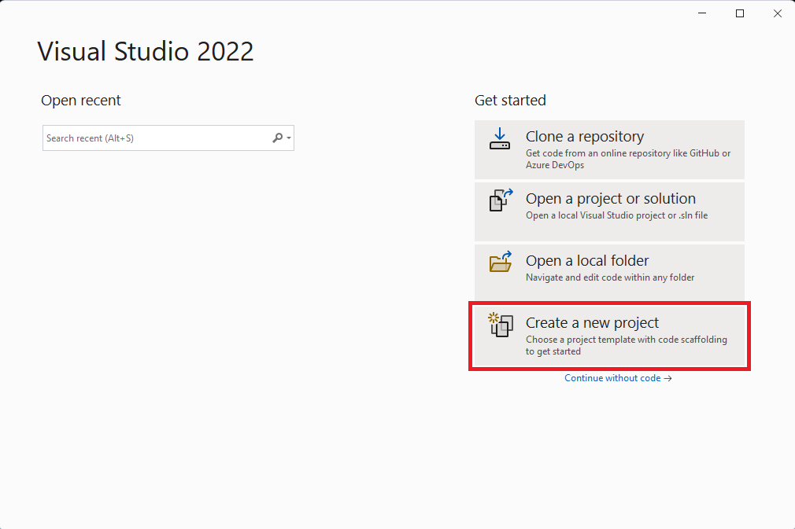
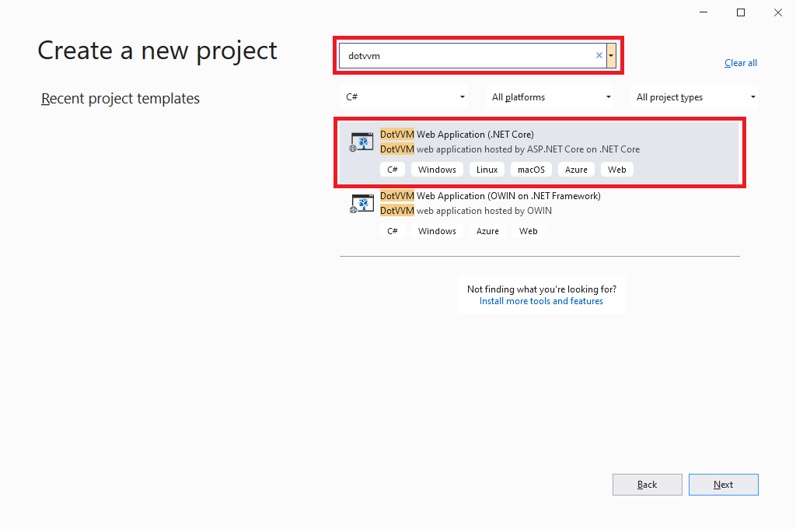
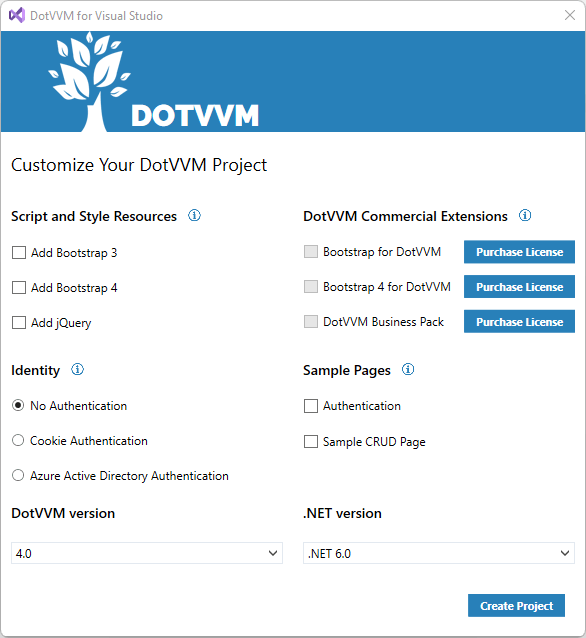

# Create a new project

The easiest and most convenient way to work with DotVVM is to use **Visual Studio 2022** (or 2019). 

If you are using a different IDE or code editor (for example, Visual Studio Code), you can create a new DotVVM application from the command line.

## Create a DotVVM project using Visual Studio 2022

### Prerequisites

First, **make sure you have the [DotVVM for Visual Studio](https://www.dotvvm.com/get-dotvvm) extension installed**:

* Open the **Extensions > Manage Extensions** menu and type `DotVVM` in the search box.
* Click on the **Install** button. 
* Restart Visual Studio so the extension can be installed.

> If you cannot find the extension, make sure you have the latest updates of Visual Studio installed. The extension always supports the latest version. If you want to use the preview versions of Visual Studio, refer to the [Release notes](~/pages/dotvvm-for-visual-studio/release-notes) page to download a specific version of extension.

### Create a new project

Run Visual Studio and select **Create a new project** on the launch screen.



Then, search for `DotVVM` and select **DotVVM Web Application (.NET Core)**:



In the next screen, configure which libraries, component packs or sample pages you want to include in the project.



After you confirm the selection, Visual Studio will create the project. **Press F5 to run the application.**

See the [Project structure](~/pages/concepts/project-structure) chapter for more info about the files in the project.

## Create a DotVVM project from a command line

If you want to start a new project without Visual Studio, you can **install the DotVVM template** using the [.NET Command Line tool](https://docs.microsoft.com/en-us/dotnet/core/tools/).

* Run the following command to install DotVVM project template.

```
dotnet new --install DotVVM.Templates
```

* Create a directory in which you want to install the app and navigate inside:

```
mkdir SampleDotvvmApp
cd SampleDotvvmApp
```

* Create the project in the current folder:

```
dotnet new dotvvm
```

* Run the project

```
dotnet run
```

## See also

* [Tutorial: The first page](~/pages/quick-starts/build/first-page)
* [Project structure](~/pages/concepts/project-structure)
* [Add DotVVM to an existing project](~/pages/quick-starts/modernize/add-dotvvm-to-existing-app)
