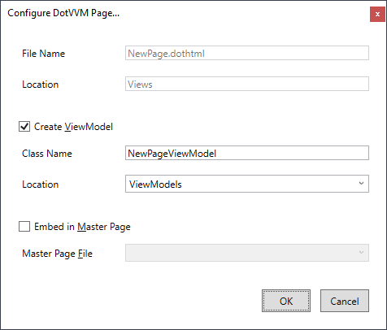

# The first page

Every page in DotVVM consists of a _view_ and a _viewmodel_.

To create a page in Visual Studio, right-click on the desired folder in the Solution Explorer window and choose **Add > New Item...**.

In the dialog, navigate to the **Web / DotVVM** section and choose the **DotVVM Page** template.

After you enter the name of the page and confirm the selection, another window will appear. In this window, you can specify whether you want to create a viewmodel for the page, and where the page should be placed.

After you proceed, the view and viewmodel files will be added to the project. 

## Routing and naming conventions

By default, all pages in the `Views` folder are registered in the route table by their path using [Route auto-discovery](../../concepts/routing/auto-discover-routes). You should be able to access the page by navigating to `/Path/To/The/Page` in the browser.

See the [Routing](../../concepts/routing/overview) for more info about configuring the page route.

> If the view is placed in the `Views` folder, the viewmodel will be automatically placed in the `ViewModels` folder. You don't have to follow this convention - some developers prefer to have the views together with viewmodels in the same folder. Feel free to use a different folder structure.

## See also

* [Tutorial: Build a To-do list app](build-to-do-list-app)
* [DotHTML markup](../../concepts/dothtml-markup/overview)
* [Data-binding](../../concepts/data-binding/overview)
* [Viewmodels](../../concepts/viewmodels/overview)
* [Routing](../../concepts/routing/overview)