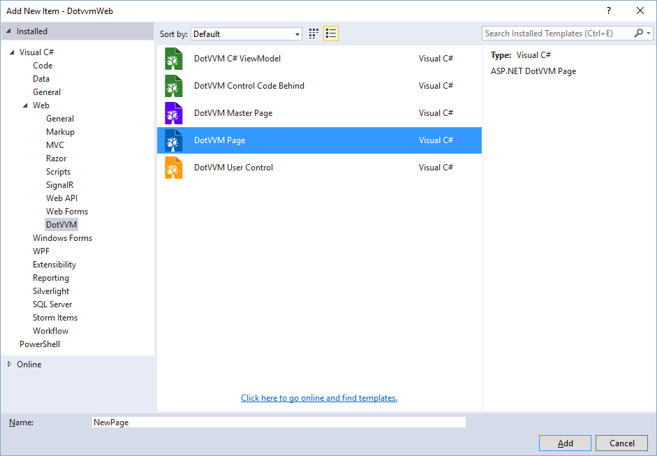
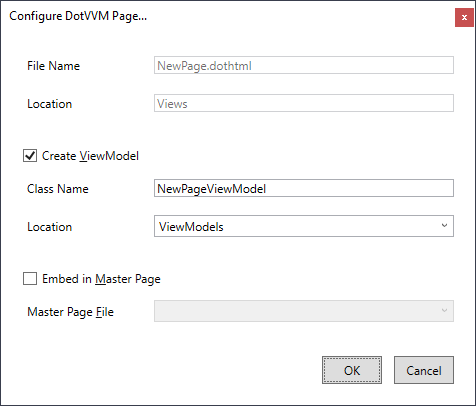

# The first page

Every page in DotVVM consists of a _view_ and a _viewmodel_.

When you [create a new project](create-new-project), there is already a page named `Default.dothtml` and its corresponding viewmodel `DefaultViewModel.cs`. There is also a [master page](~/concepts/layout/master-pages) which is used to define the main structure, header, and footer for all pages in the application. 

You can start by editing the default page, or choose to add a new page. To create a page in Visual Studio, right-click on the desired folder in the Solution Explorer window and choose **Add > New Item...**.

In the dialog, navigate to the **Web / DotVVM** section and choose the **DotVVM Page** template.



After you enter the name of the page and confirm the selection, another window will appear. In this window, you can specify whether you want to create a viewmodel for the page, and where the page should be placed.



After you proceed, the view and viewmodel files will be added to the project. 

## Routing and naming conventions

DotVVM pages need to be registered in the route table to be mapped on a particular URL. If you add a new page, you need to add the following registration into the `ConfigureRoutes` method in `DotvvmStartup.cs` file.

```csharp
config.RouteTable.Add("Page", "my/page/url", "Views/page.dothtml", new { });
```

After doing so, you should be able to access the page by navigating to `/Path/To/The/Page` in the browser.See the [Routing](../../concepts/routing/overview) for more info about configuring page routes.

Alternatively, you can configure [Route auto-discovery](../../concepts/routing/auto-discover-routes) to discover all pages in a particular folder and define a convention to register them automatically. 

> If the view is placed in the `Views` folder, the viewmodel will be automatically placed in the `ViewModels` folder. You don't have to follow this convention - some developers prefer to have the views together with viewmodels in the same folder. Feel free to use a different folder structure.

## See also

* [Tutorial: Build a To-do list app](build-to-do-list-app)
* [DotHTML markup](../../concepts/dothtml-markup/overview)
* [Data-binding](../../concepts/data-binding/overview)
* [Viewmodels](../../concepts/viewmodels/overview)
* [Routing](../../concepts/routing/overview)