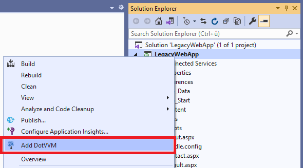

# Add DotVVM to existing project

DotVVM is distributed as a NuGet package (`DotVVM.OWIN` or `DotVVM.AspNetCore`) and can be used in existing ASP.NET or ASP.NET Core applications side by side with other frameworks.

## Install & configure DotVVM using Visual Studio

### Prerequisites

First, **make sure you have the [DotVVM for Visual Studio](https://www.dotvvm.com/get-dotvvm) extension installed**:

* Open the **Extensions > Manage Extensions** menu and type `DotVVM` in the search box.
* Click on the **Install** button. 
* Restart Visual Studio so the extension can be installed.

> If you cannot find the extension, make sure you have the latest updates of Visual Studio installed. The extension always supports the latest version. If you want to use the preview versions of Visual Studio, refer to the [Release notes](~/pages/dotvvm-for-visual-studio/release-notes) page to download a specific version of extension.

### ASP.NET Web Application Project or ASP.NET Core App

Open your ASP.NET or ASP.NET Core project. Make sure that all NuGet packages are restored and the project can be built.

**If the project is using older version of .NET Framework than 4.5.1, upgrade the project first.**

> We recommend using .NET 4.7.2 or newer with DotVVM in order to prevent .NET Standard 2.0-related problems in older versions of .NET.

Once the project is buildable and running on .NET 4.5.1 or newer, you can **right-click on the project** in the Solution Explorer window and choose **Add DotVVM**.



After the process finishes, you should be able to run the application without any changes. You can [add new DotVVM pages](~/pages/quick-starts/build/first-page) in the project and make sure DotVVM runtime loads correctly.

See the [Plan the modernization](~/pages/quick-starts/modernize/plan-the-modernization) chapter for more information on how to plan the migration.

### ASP.NET Web Site Project

DotVVM framework itself should run as part of a Web Site project, however the DotVVM for Visual Studio extension doesn't support Web Site projects and most of its features including IntelliSense will not work properly. 

We recommend to [convert the Web Site project to the Web Application first](https://devblogs.microsoft.com/aspnet/converting-a-web-site-project-to-a-web-application-project/).

### VB.NET support

DotVVM framework itself works with VB.NET, however the DotVVM for Visual Studio extension doesn't support Web Site projects and most of its features including IntelliSense will not work properly. 

In such case, we recommend to create a DotVVM project aside of the VB.NET project and reference it from the VB.NET project. See [VB.NET version of Web Forms modernization sample using DotVVM](https://github.com/riganti/dotvvm-samples-webforms-migration-vbnet) to see how to configure the projects to work together.

## Install & configure DotVVM manually

### ASP.NET Web Application

If you want to install DotVVM packages in an ASP.NET application manually, please follow the steps in the [C# version of Web Forms modernization sample using DotVVM](https://github.com/riganti/dotvvm-samples-webforms-migration).

### ASP.NET Core apps

To add DotVVM in an existing ASP.NET Core project manually, simply install `DotVVM.AspNetCore` Nuget package using Package Manager Console:

```
    Install-Package DotVVM.AspNetCore
```

This command will also reference the dependent packages `DotVVM.Framework` and `DotVVM.Core`.

#### Initialization

To register DotVVM in the request pipeline, you have to do two things in the `Startup` class:

* Add DotVVM services in the `IServiceCollection` object.

* Add the DotVVM middlewares in the ASP.NET Core request pipeline.

First, add the following code snippet in the `ConfigureServices` method:

```CSHARP
services.AddDotVVM<DotvvmStartup>();
```

Second, add the following code snippet in the `Configure` method. If you are using some authentication middlewares, remember that these should be registered first.

```CSHARP
var config = app.UseDotVVM<DotvvmStartup>(env.ContentRootPath);
```

The `config.Debug` property is set automatically based on [IHostingEnvironment.IsDevelopment()](https://docs.microsoft.com/en-us/aspnet/core/api/microsoft.aspnetcore.hosting.hostingenvironmentextensions#Microsoft_AspNetCore_Hosting_HostingEnvironmentExtensions_IsDevelopment_Microsoft_AspNetCore_Hosting_IHostingEnvironment_). 

#### Adding the DotvvmStartup class

Notice that the code references the `DotvvmStartup` class. It is a class you have to add in your project too. 
This class contains the configuration of DotVVM itself, e.g. the registration of routes in your app.

```CSHARP
using DotVVM.Framework;
using DotVVM.Framework.Configuration;
using DotVVM.Framework.ResourceManagement;
using DotVVM.Framework.Routing;

namespace DotvvmDemo
{
    public class DotvvmStartup : IDotvvmStartup, IDotvvmServiceConfigurator
    {
        public void ConfigureServices(IDotvvmServiceCollection services)
        {
            services.AddDefaultTempStorages("Temp");
        }

        public void Configure(DotvvmConfiguration config, string applicationPath)
        {
            // register your routes, controls and resources here
        }        
    }
}
```

## See also

* [Plan the modernization](~/pages/quick-starts/modernize/plan-the-modernization)
* [Create the first page](~/pages/quick-starts/build/first-page)
* [Web Forms modernization sample using DotVVM - C# version](https://github.com/riganti/dotvvm-samples-webforms-migration)
* [Web Forms modernization sample using DotVVM - VB.NET version](https://github.com/riganti/dotvvm-samples-webforms-migration)