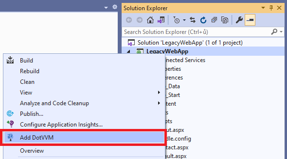

# Add DotVVM to existing project

DotVVM is distributed as a NuGet package (`DotVVM.Owin` or `DotVVM.AspNetCore`) and can be used in existing ASP.NET or ASP.NET Core applications side by side with other frameworks.

> You can find more information about modernizing .NET web applications in a book [Modernizing .NET Web Applications](https://www.modernizationbook.com) by Tomas Herceg. One of the book's chapters is dedicated to DotVVM and shows the process of migrating ASP.NET Web Forms applications to the latest version of .NET. 

## Install & configure DotVVM using Visual Studio

### Prerequisites

First, **make sure you have the [DotVVM for Visual Studio](https://www.dotvvm.com/get-dotvvm) extension installed**:

* Open the **Extensions > Manage Extensions** menu and type `DotVVM` in the search box.
* Click on the **Install** button. 
* Restart Visual Studio so the extension can be installed.

> If you cannot find the extension or if the extension reports errors when Visual Studio is started, make sure you have **the latest updates of Visual Studio installed**. The extension is sensitive to exact version of some Visual Studio assemblies, and it may not work properly with older releases. We recommend to check out the [Release notes](~/pages/dotvvm-for-visual-studio/release-notes) page to see which version of the extension is compatible with which build of Visual Studio. If you use preview versions of Visual Studio, always download the extension from the [Release notes](~/pages/dotvvm-for-visual-studio/release-notes) page. 

### ASP.NET Web Application Project or ASP.NET Core App

Open your ASP.NET or ASP.NET Core project. Make sure that all NuGet packages are restored and the project can be built.

**If the project is using older version of .NET Framework than 4.7.2, upgrade the project to .NET Framework 4.7.2 or newer.**

> We recommend using the most current version of .NET Framework as the starting point.

Once the project is buildable and running on .NET Framework 4.7.2 or newer, you can **right-click on the project** in the Solution Explorer window and choose **Add DotVVM**.



After the process finishes, you should be able to run the application without any changes. You can [add new DotVVM pages](~/pages/quick-starts/build/first-page) in the project and make sure DotVVM runtime loads correctly.

There are some situations in which the process may fail. If it is the case, perform the following steps manually:

* Install `Microsoft.Owin.Host.SystemWeb` package.
* Install `Dotvvm.Owin` NuGet package.
* Add the OWIN Startup Class `Startup.cs`.
* Add the DotVVM Configuration file `DotvvmStartup.cs`.
* Unload the project.
* Add the DotVVM project type GUID (`94EE71E2-EE2A-480B-8704-AF46D2E58D94`) as the first semicolon-separated identifier in the `<ProjectTypeGuids>` element in the `.csproj` file to make the DotVVM extension in Visual Studio work properly.
* Reload the project.

See the [Plan the modernization](~/pages/quick-starts/modernize/plan-the-modernization) chapter for more information on how to plan the migration.

### ASP.NET Web Site Project

DotVVM framework itself should run as part of a Web Site project, however the DotVVM for Visual Studio extension doesn't support Web Site projects and most of its features including IntelliSense will not work properly. 

We recommend to [convert the Web Site project to the Web Application first](https://devblogs.microsoft.com/aspnet/converting-a-web-site-project-to-a-web-application-project/).

### VB.NET support

DotVVM framework itself works with VB.NET, however the DotVVM for Visual Studio extension doesn't support Web Site projects and most of its features including IntelliSense will not work properly. 

In such case, we recommend to create a DotVVM project aside of the VB.NET project and reference it from the VB.NET project. See [VB.NET version of Web Forms modernization sample using DotVVM](https://github.com/riganti/dotvvm-samples-webforms-migration-vbnet) to see how to configure the projects to work together.

## Install & configure DotVVM manually

### ASP.NET Web Application

If you want to install DotVVM packages in an ASP.NET application manually, please follow the steps in the [C# version of Web Forms modernization sample using DotVVM](https://github.com/riganti/dotvvm-samples-webforms-migration).

### ASP.NET Core apps

To add DotVVM in an existing ASP.NET Core project manually, simply install `DotVVM.AspNetCore` Nuget package using Package Manager Console:

```
Install-Package DotVVM.AspNetCore
```

This command will also reference the dependent packages `DotVVM` and `DotVVM.Core`.

#### Initialization

To register DotVVM in the request pipeline, you have to do two things in the `Startup` class:

* Add DotVVM services in the `IServiceCollection` object.

* Add the DotVVM middlewares in the ASP.NET Core request pipeline.

Add the following lines in `Program.cs` or in the `Configure/ConfigureServices` method in `Startup.cs` if you use the older pattern of project startup:

# [New method with Program.cs](#tab/new-program-cs)

```CSHARP
// Program.cs
...
builder.Services.AddDotVVM<DotvvmStartup>();

...

app.UseDotVVM<DotvvmStartup>();
...
```

# [Older method with Startup.cs](#tab/old-startup-cs)
```CSHARP
// Startup.cs
...

public void ConfigureServices()
{
    ...
    services.AddDotVVM<DotvvmStartup>();
}

public void Configure(IWebHostEnvironment env) 
{
    ...
    var config = app.UseDotVVM<DotvvmStartup>(env.ContentRootPath);
}
```

***

The `config.Debug` property is set automatically based on [IHostingEnvironment.IsDevelopment()](https://docs.microsoft.com/en-us/dotnet/api/microsoft.extensions.hosting.hostingenvironmentextensions?view=dotnet-plat-ext-5.0). 

#### Adding the DotvvmStartup class

Notice that the code references the `DotvvmStartup` class. It is a class you have to add in your project too. 
This class contains the configuration of DotVVM itself, e.g. the registration of routes in your app.

```CSHARP
using DotVVM.Framework;
using DotVVM.Framework.Configuration;
using DotVVM.Framework.ResourceManagement;
using DotVVM.Framework.Routing;

namespace DotvvmDemo
{
    public class DotvvmStartup : IDotvvmStartup, IDotvvmServiceConfigurator
    {
        public void Configure(DotvvmConfiguration config, string applicationPath)
        {
            // register your routes, controls and resources here
        } 

        public void ConfigureServices(IDotvvmServiceCollection services)
        {
            services.AddDefaultTempStorages("Temp");
        }
    }
}
```

## See also

* [Plan the modernization](~/pages/quick-starts/modernize/plan-the-modernization)
* [Create the first page](~/pages/quick-starts/build/first-page)
* [Modernizing .NET Web Applications book](https://www.modernizationbook.com)
* [Web Forms modernization sample using DotVVM - C# version](https://github.com/riganti/dotvvm-samples-webforms-migration)
* [Web Forms modernization sample using DotVVM - VB.NET version](https://github.com/riganti/dotvvm-samples-webforms-migration)