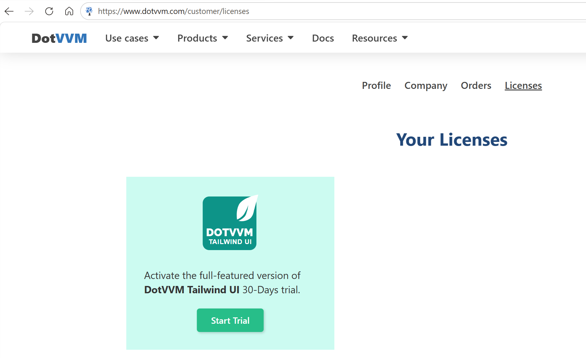

# Getting started with DotVVM Tailwing UI

[DotVVM Tailwing UI](https://www.dotvvm.com/products/dotvvm-tailwind-ui) is a set of modern-looking UI components and design elements built with [Tailwind](https://tailwindcss.com/) - a popular frontend framework.

## Get 30-days trial

You can **try DotVVM Tailwing UI for 30 days for free**.

1. [Sign in on dotvvm.com](https://www.dotvvm.com/login)

2. In the **Licenses** section, request the trial version.



> If you need more time to test the features of DotVVM Tailwind UI, [contact us](https://www.dotvvm.com/support/contact-us) - we'll be happy to help.

## Install Tailwind UI in the project

> This option is not available in the DotVVM for Visual Studio extension yet, it will be present when the final stable of the library is published. Until then, follow the instructions in [Manual installation](#manual-installation) section. 

1. Right-click on the project in the _Solution Explorer_ window in Visual Studio, and select the **Manage NuGet Packages** option:


2. Ensure th **Install** button in the _DotVVM Tailwind UI_ section.


> If you don't see any controls with the `<t:` prefix in the IntelliSense after the packages are installed, try launching the application - the IntelliSense will refresh the project configuration.

## Manual installation

If you don't want to use the wizard, you can install Business Pack manually by taking the following steps:

1. Make sure you have configured [DotVVM Private NuGet Feed](~/pages/dotvvm-for-visual-studio/dotvvm-private-nuget-feed).

2. Install the `DotVVM.Controls.Tailwind` package in the project.

2. Open the `DotvvmStartup.cs` file and add the following line in the `Configure` method:

```CSHARP
public void Configure(DotvvmConfiguration config, string applicationPath)
{
    config.AddTailwindControls();
   ...
}
``` 

This will register all Tailwind controls under the `<t:*` tag prefix, and it also registers the required Tailwind resources and server-side styles. 

## See also

* [Tailwind UI controls](~/controls/tailwind/Accordion)
* [Release notes](release-notes)
